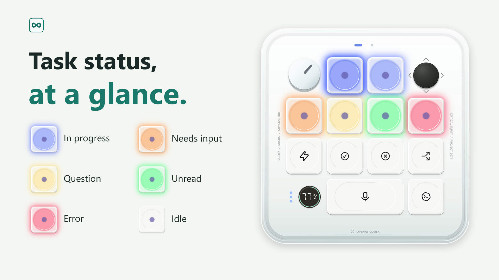
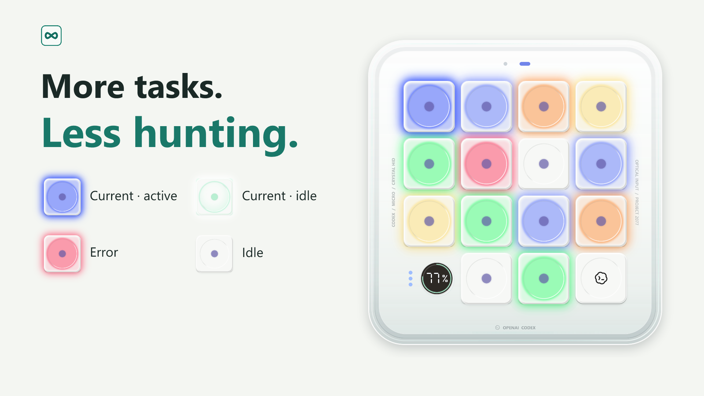
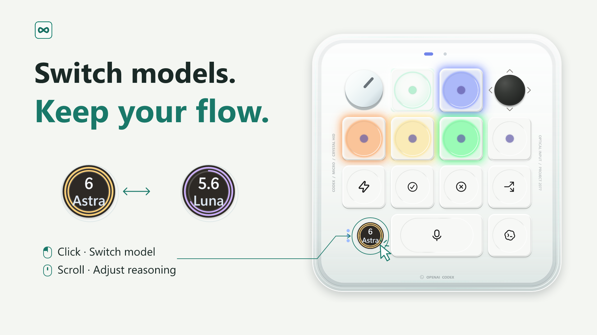

# Codex Micro Monitor

Local macOS control preview: [build and scope](apps/macos/README.md). Layered settings and new-draft controls await the updated Windows contracts; live UI acceptance is pending.

A Windows desktop companion for Codex. See task status, switch models and reasoning effort, check usage, and toggle Fast.

## Install

Requires Windows 10 build 19041+ / Windows 11 x64 and a signed-in Codex desktop app. The current driverless adaptation baseline is **Codex 26.930.3930.0**. Earlier versions are unverified, and later desktop updates may require adaptation.

- **Microsoft Store:** [install from the Store](https://apps.microsoft.com/detail/9NTVMG9QNMHC). Includes the .NET runtime; no separate runtime installation is needed.
- **GitHub compact ZIP:** download `codex-micro-monitor-<version>-win-x64-compact.zip` from [Releases](https://github.com/gantrol/codex-micro-monitor/releases/latest), extract it, and run `CodexMicro.exe`. Requires [.NET 10 Desktop Runtime x64](https://dotnet.microsoft.com/en-us/download/dotnet/10.0); if a compatible runtime is already installed, no additional installation is needed. SHA-256 checksums are included with the release.
- **Codex Plugin:** download the plugin ZIP from [plugin Releases](https://github.com/gantrol/codex-plugin-micro-keypad/releases/latest). Requires .NET 10 Desktop Runtime x64. Extract the entire `codex-micro-monitor-plugin-<version>-win-x64.zip`, keeping `.agents/` and `plugins/`. From the extracted root, run `codex plugin marketplace add .` with the Codex CLI. Restart Codex, open **Plugins → Codex Micro Monitor**, and install `codex-micro-keypad`. In a new chat, ask it to open Codex Micro Monitor. See the [official marketplace guide](https://developers.openai.com/plugins/build/plugins#add-a-marketplace-from-the-cli).

The desktop app is available on Microsoft Store and GitHub Releases. Public plugin-directory publication is still pending. See [build and distribution](docs/build-and-distribution.md).

For local development, open [codex-micro.code-workspace](codex-micro.code-workspace) with sibling checkouts of `codex-control` and `codex-plugin-micro-keypad`. The [repository map](docs/repository-layout.zh-CN.md) defines source ownership and one-way plugin synchronization.

## Notice

Codex Micro Monitor recreates the interaction and visual style of [Codex Micro](https://learn.chatgpt.com/docs/features/codex-micro) in software. No Micro hardware or virtual HID driver required. Originally maintained as part of [AgentController](https://github.com/gantrol/AgentController), it is now maintained independently in this repository.

This is an independent third-party project, not affiliated with or endorsed by OpenAI or Work Louder. Product names and trademarks belong to their respective owners. Images show the software with example data; supported features differ from the hardware.

[PolyForm Noncommercial 1.0.0](LICENSE).
