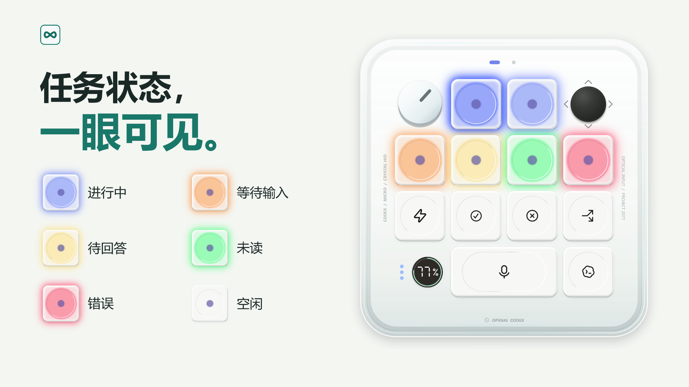
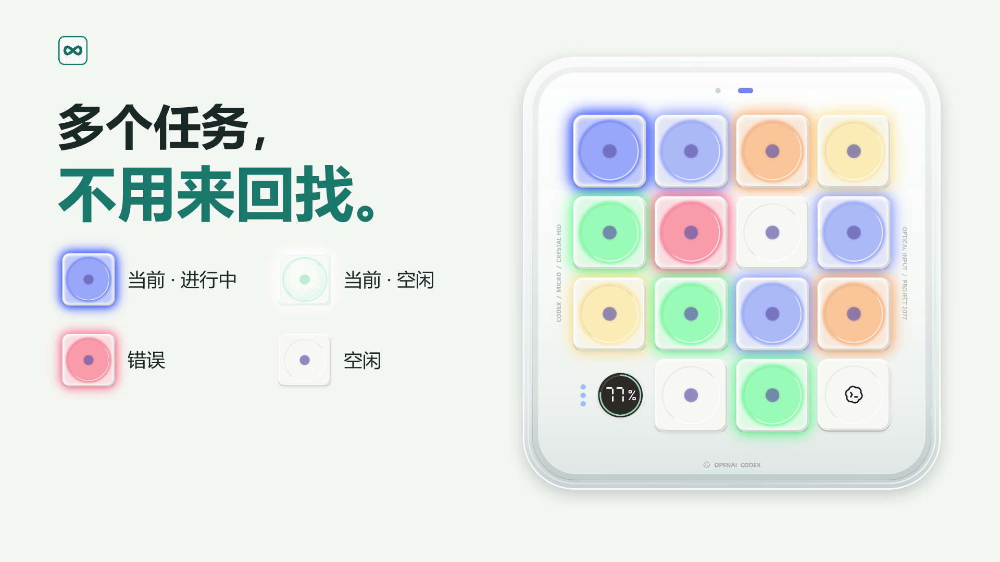
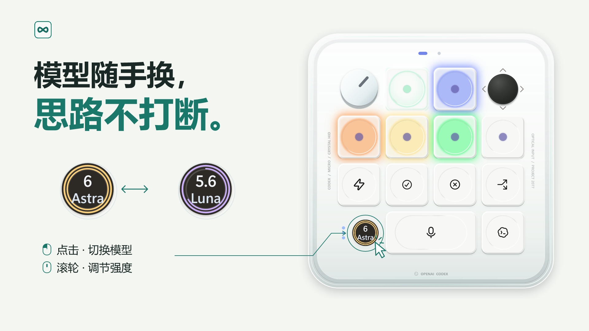

# Codex Micro Monitor

本地 macOS 控制预览版：[构建与能力范围](apps/macos/README.md)。叠层设置和新对话控制等待 Windows 更新对齐，真实 UI 验收尚未执行。

用于 Codex 的 Windows 桌面工具，直观看任务状态，快速切换模型与推理强度，查看额度，按需开启 Fast。

## 安装

需要 Windows 10 build 19041+ / Windows 11 x64，以及已登录的 Codex 桌面应用。当前免驱适配基线为 **Codex 26.930.3930.0**；更早版本未验证，后续 Codex 更新可能需要跟进适配。

- **Microsoft Store**：[从商店安装](https://apps.microsoft.com/detail/9NTVMG9QNMHC)，已包含 .NET 运行时，无需另外安装。
- **GitHub 精简包**：从 [Releases](https://github.com/gantrol/codex-micro-monitor/releases/latest) 下载 `codex-micro-monitor-<版本>-win-x64-compact.zip`，完整解压后运行 `CodexMicro.exe`。需要 [.NET 10 Desktop Runtime x64](https://dotnet.microsoft.com/en-us/download/dotnet/10.0)，已安装兼容运行时的用户无需重复安装。Release 附有 SHA-256 校验文件。
- **Codex Plugin**：从[插件 Releases](https://github.com/gantrol/codex-plugin-micro-keypad/releases/latest) 下载插件包，需要 .NET 10 Desktop Runtime x64。完整解压 `codex-micro-monitor-plugin-<版本>-win-x64.zip`，保留 `.agents/` 和 `plugins/`。在解压根目录通过 Codex CLI 执行 `codex plugin marketplace add .`，重启 Codex，在 **插件 → Codex Micro Monitor** 中安装 `codex-micro-keypad`，随后新建对话并说“打开 Codex Micro Monitor”。详见[官方 marketplace 指南](https://developers.openai.com/plugins/build/plugins#add-a-marketplace-from-the-cli)。

桌面应用已在 Microsoft Store 和 GitHub Releases 发布，公开插件目录尚未发布。构建方式及插件发布路线见[开发说明](docs/build-and-distribution.md)。

本地开发打开 [codex-micro.code-workspace](codex-micro.code-workspace)，与相邻的 `codex-control`、`codex-plugin-micro-keypad` 一起维护。源码归属和插件单向同步见[仓库关系](docs/repository-layout.zh-CN.md)。

## 声明

Codex Micro Monitor 以软件形式复现 [Codex Micro](https://learn.chatgpt.com/docs/features/codex-micro) 的交互与视觉风格，无需 Micro 硬件或虚拟 HID 驱动。本项目此前在 [AgentController](https://github.com/gantrol/AgentController) 项目中维护，现已迁至本仓库独立维护。

本项目为独立第三方项目，与 OpenAI、Work Louder 无隶属关系，也未获得其背书。相关名称与商标归各自权利人所有。配图为软件界面及示例数据，功能范围与实体 Codex Micro 不完全相同。

许可证：[PolyForm Noncommercial 1.0.0](LICENSE)。
