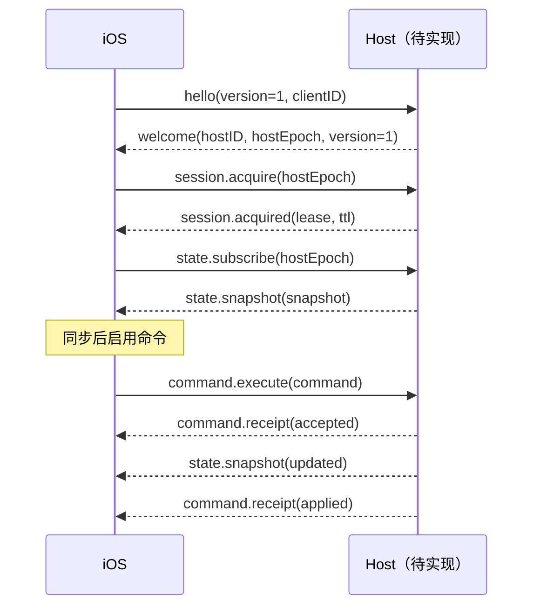

# Micro Remote Protocol · iOS v0.1 子集

这是原型客户端的合同，尚无配套网络 Host。架构文档中的完整协议仍是后续设计；本文的字段大小写与 Swift `Codable` 一致，优先用于本原型联调。

WSS 连接携带 `Authorization: Bearer <device-token>`。服务端必须验证设备权限；证书校验发生在发送令牌之前。文本帧为 UTF-8 JSON，单条上限 1 MiB。

## 连接顺序



```json
{"type":"hello","protocolVersion":1,"clientID":"phone-generated-UUID"}
{"type":"welcome","protocolVersion":1,"hostID":"stable-host-id","hostEpoch":"host-startup-UUID"}
{"type":"session.acquire","hostEpoch":"host-startup-UUID"}
{"type":"session.acquired","hostEpoch":"host-startup-UUID","controlLeaseID":"lease-id","ttlSeconds":30}
{"type":"state.subscribe","hostEpoch":"host-startup-UUID"}
```

客户端在租约 TTL 一半处发送 `session.renew`，携带 `hostEpoch`、`controlLeaseID`。Host 以 `session.renewed` 返回租约和 `ttlSeconds`，字段与 acquired 相同。TTL 必须在 5–300 秒之间；过期即断开。Host 必须独立校验租约，不能信任手机计时。

首次同步超时为 12 秒。新租约要求新快照；后台挂起后重新握手。没有自动重连循环。

## 状态快照

```json
{
  "type": "state.snapshot",
  "snapshot": {
    "hostID": "stable-host-id",
    "hostEpoch": "host-startup-UUID",
    "revision": 42,
    "threads": [{
      "id": "thread-id",
      "title": "任务名称",
      "status": "waiting",
      "modelID": "model-from-host",
      "effort": "high",
      "fast": false,
      "plan": false,
      "approvalID": "approval-id",
      "approvalSummary": "git status",
      "capabilities": ["desktop.openThread", "thread.setModel", "thread.setEffort", "thread.setFast", "thread.setPlan", "approval.accept", "approval.decline", "thread.fork"]
    }],
    "models": [{"id":"model-from-host","name":"Model","efforts":["low","medium","high"]}],
    "quota": {"fiveHour":77,"weekly":58}
  }
}
```

- `revision` 在同一 Host epoch 内单调递增；重复或旧版本不更新 Store。`hostID` 必须稳定，Host 每次重启更换 `hostEpoch`。
- `threads` / `models` 均最多 256 条，ID 非空且各自唯一。列表顺序决定键位；每个按键绑定稳定任务 ID。
- `status`：`idle`、`running`、`completed`、`waiting`、`error`。运行中的任务提供可选 `turnID`，用于停止操作。
- 审批需要 `approvalID` 和非空 `approvalSummary`，缺少任一字段时禁用审批。v0.1 每个任务只表示一个当前审批；多审批选择仍待实现。
- `quota` 为剩余百分比 0–100；未知字段可省略或设为 `null`，显示为 `--`。
- `capabilities` 为下表命令集合，使用闭合枚举。新增枚举值前需要升级客户端 / 协议；未知消息类型会断开连接。
- v0.1 收到 `state.delta`（必须含当前 `hostEpoch`）时暂停控制并重新 `state.subscribe`，由 Host 补发完整快照，不应用 patch。

## 命令与回执

```json
{
  "type": "command.execute",
  "command": {
    "requestID": "00000000-0000-4000-8000-000000000001",
    "hostID": "stable-host-id",
    "hostEpoch": "host-startup-UUID",
    "controlLeaseID": "lease-id",
    "threadID": "thread-id",
    "kind": "thread.setEffort",
    "expectedRevision": 42,
    "value": "high"
  }
}
```

| `kind` | 参数 |
| --- | --- |
| `desktop.openThread` | 无 |
| `thread.setModel` | `value`：Host 目录中的模型 ID |
| `thread.setEffort` | `value`：当前模型支持的强度 |
| `thread.setFast` / `thread.setPlan` | `value`：字符串 `"true"` / `"false"` |
| `approval.accept` / `approval.decline` | `approvalID`，必须仍是同一有效请求 |
| `thread.fork` | 无 |
| `turn.stop` | `turnID`，必须仍是同一运行回合 |

Host 必须核验设备权限、目标归属、epoch、租约、能力、预期状态与参数，并按 `requestID` 去重。收到请求只返回 accepted；执行并回读确认后，**先发布最新快照，再返回 applied**。不能把写入队列成功当作操作已完成。

```json
{"type":"command.receipt","hostEpoch":"host-startup-UUID","receipt":{"requestID":"00000000-0000-4000-8000-000000000001","status":"accepted"}}
{"type":"command.receipt","hostEpoch":"host-startup-UUID","receipt":{"requestID":"00000000-0000-4000-8000-000000000001","status":"applied"}}
```

其他状态：`rejected`（拒绝）、`notSent`（确认未提交）、`unknown`（无法证明结果）。可选 `reason` 用于结果展示。未决请求在 15 秒后显示待确认，禁止继续提交；accepted 不解锁操作。

```json
{"type":"command.status","hostEpoch":"current-host-epoch","requestIDs":["00000000-0000-4000-8000-000000000001"]}
```

查询结果逐条返回 `command.receipt`。Host 应保留跨重连、跨重启的请求记录；查不到时返回 unknown，不能假定未执行。客户端在 UserDefaults 保存真实 Host 的未决命令，只用于查询，不重放。这个原型未提供放弃 unknown 记录的入口，需 Host 给出终态后恢复控制。

服务端连接错误使用 `{"type":"error","reason":"原因"}`；客户端断开并禁用控制。远程使用的权限验证、持久化账本、Codex 适配和配对服务均属于尚待实现的 Host 工作。
