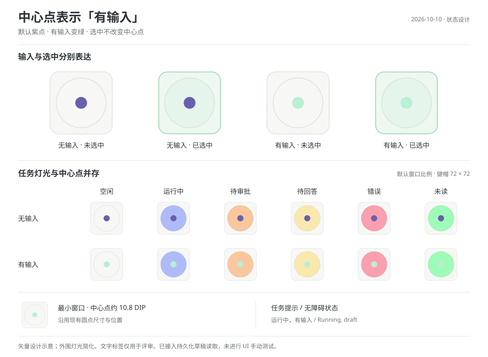

# 任务键草稿标记设计

更新：2026-10-10。状态：中心点呈现与持久化草稿读取已接入；覆盖范围与验证边界见下文。范围：Windows Micro 控制页与监控页的任务键。

## 语义

“有输入”表示该输入框存在尚未提交的有效内容，包括恢复的旧草稿。它不表示用户此刻正在打字，也不表示内容已保存到磁盘。已发送的历史消息、已被接受的排队消息不属于输入框草稿。

中心点专门表达输入状态：默认紫色，确认有输入时变绿。外围灯光继续表达运行、审批、待回答、错误与未读；选中使用现有键帽与外围效果，单纯选中不再改变中心点的颜色、透明度或形状。草稿不加入 `ThreadStatus` 的互斥状态，也不改变任务排序。

## 外观

直接复用现有中心圆点。确认有输入时，紫点变为绿点；输入清空或成功提交后恢复紫点。取消额外图标及角标，键帽不增加新的视觉元素。

图为矢量设计示意，灯光用平面色简化，不能作为现有 WPF 的实际渲染或验收证据。尺寸基于当前源码的 96 × 96 键帽、590 × 610 设计面、442.5 × 457.5 默认窗口与 354 × 366 最小窗口。文档中的说明与尺寸标签仅用于设计评审，不进入产品界面。

| 项目 | 约定 |
| --- | --- |
| 位置 | 复用键帽中心；相对 96 × 96 键帽，圆心为 `(48, 48)` |
| 图形 | 复用直径 18 的圆点 |
| 颜色 | 默认紫色 `#685FAE`；有输入时薄荷绿 `#B9EFD2`，沿用原来当前会话中心点的颜色，使用输入语义的组件画刷 |
| 尺寸 | 设计坐标 18；默认显示约 13.5 DIP，最小窗口约 10.8 DIP；这些是布局推导值，非实测 |
| 层次 | 圆点在键帽与凹槽灯光之上，使用不透明填充，避免外围灯光混色；跟随键帽按下和位移动画 |
| 选中 | 只更新键帽及外围选中效果；有输入一直是绿点，无输入一直是紫点，不切换为白点或薄荷点 |
| 装饰 | 不增加图标、角标、闪烁、呼吸或打字动画 |
| 有无切换 | 只切换圆点填充；尺寸与透明度固定，不触发任务重排 |
| 点击 | 标记自身不接收点击、不成为焦点；点击所在键帽仍执行该键已有动作 |
| 提示 | 现有任务提示和无障碍状态追加“有输入” / “Draft”；不显示草稿正文 |

高对比度模式使用系统可区分的前景/高亮颜色，提示与无障碍状态保留输入事实，不增加辅助图标或产品解释文案。默认和最小尺寸下沿用现有圆点尺寸。

## 与现有状态组合

| 任务情况 | 呈现 |
| --- | --- |
| 空闲，有输入 | 空闲键帽，中心绿点 |
| 当前会话，无输入 | 外围选中效果，中心仍为紫点 |
| 当前会话，有输入 | 外围选中效果，中心仍为绿点 |
| 运行中，有输入 | 原运行灯光，中心绿点 |
| 等待审批或回答，有输入 | 原橙色或黄色灯光，中心绿点 |
| 错误，有输入 | 原错误灯光，中心绿点 |
| 未读，有输入 | 原未读绿色外围灯光，中心绿点；输入本身不修改已读状态 |
| 未读，无输入 | 原未读绿色外围灯光，中心紫点；外围绿色不代表有输入 |
| 确认无草稿 | 中心恢复默认紫点 |
| 草稿观察未知或失效 | 中心恢复默认紫点，不继续显示确定性的绿色；已有任务提示可表达“输入状态未知” / “Draft status unknown” |

默认紫点也用于尚未取得有效观察时，不承诺输入框一定为空；未知与确认空白在数据及无障碍状态中分别表达。草稿观察是否有效与任务运行状态是否有效分别判断，不直接复用任务灯的连接状态。所有状态组合均在外围灯光之后独立绘制中心点。

## 内容与生命周期

- 普通文字、粘贴、语音转写、程序填入和历史草稿恢复使用同一判定；不通过键盘活动推断草稿。
- 纯空白、编辑器占位符不算内容。对零宽字符和对象替代字符，结合编辑器结构判断，不能删除后直接得出“没有附件”。
- 富文本中的引用、技能、链接等已识别节点构成输入；默认模型、目录、模式等持久上下文不算。单独的图片/文件附件可能只存在于 renderer 内存，不在当前读取来源中，不能承诺这些纯附件草稿一定亮绿点。
- 中文输入法尚未提交的组合文字不单独建立持久草稿事实；已有草稿不因组合过程被清除。
- 停顿、失焦、选中和查看历史都不清除标记。删除、剪切后确认编辑器为空才清除；撤销恢复内容后重新显示。
- 不根据 Micro 的发送点击或操作回执清除标记，只跟随最新保存的 composer 记录。Codex 提交时删除草稿记录会恢复紫点，失败后恢复记录会再次变绿；不把这个持久化观察宣称为提交成功回执。
- 发送 A 后立刻输入 B，后续刷新只读取最新记录；A 的动作回执没有清除中心点的通道。任务快照沿用递增 revision 防止旧回调覆盖新快照。
- Queue / Steer 后按 Codex 实际保存的 composer 记录显示，不从队列或已发送历史中推断草稿。后来撤回至编辑器并保存的内容重新计入。
- 切换会话不迁移标记、不清空底层草稿。原会话仍有可靠观察来源时保留标记；观察失效进入未知，不无限期使用缓存宣称当前有草稿。
- 新聊天没有正式会话 ID 时没有对应任务键，当前不把新聊天草稿借挂到上一任务。持久化记录出现正式 `local:<threadId>` 绑定后才参与判定；不按标题、最近任务或槽位猜测。
- 多窗口同一会话共享已保存的正式会话记录；当前不合并各窗口尚未保存的编辑器内存。点击键帽沿用现有窗口导航规则。
- 重启后重新读取持久化草稿，不新增本地布尔值存储。面板隐藏时撤销呈现中的输入观察，恢复后重新刷新。同一任务在两页使用相同状态；重排按任务身份移动，不能按槽位缓存。

## 实现边界

观察状态为 `Unknown / Empty / Present`，附着在 `CodexMonitoredTask` 上，跟随现有任务快照 revision 更新。`Empty` 仅表示已支持的持久化记录中没有有效内容，不排除未保存的纯附件；界面不据此追加“无输入”的绝对断言。不扩展跨平台协议或建立新的草稿存储系统。

`CodexComposerDraftReader` 解析现有全局状态文件中的 `electron-persisted-atom-state`，按正式 `local:<threadId>` 键读取 `composer-prompt-drafts-v2`。仅当整个 v2 记录缺失时读取 renderer 仍支持的 v1；不合并两个版本，以免复活已删除草稿。支持字符串、包装 draft 及 prompt 中的 ProseMirror 文档；只投影内容是否存在，不把正文写入任务对象或日志。

同时读取单独保存的 PR 附件、响应批注与已附加的演示建议记录。尚未保存的图片、文件附件，以及未识别的富文本节点没有完整覆盖；未知节点在没有其他已知内容时返回 `Unknown`。`composer-retained-documents-v1` 可能保留已提交文档，因此不作为输入依据，`prompt-history` 和 rollout 同样不参与。

读取复用现有任务监控的全局状态文本，一次刷新不为草稿另外打开文件。现有 `CodexTaskMonitorService.ReadSharedText` 在 `ReadAsync` 的 `Task.Run` 内进行同步读，读取单个全局 JSON 和单个配置文件，按文件长度与修改时间复用缓存；本次只增加纯解析，不新增同步 I/O。文件大小由用户已有状态决定，没有固定上限；未做性能前后测量。读取失败时任务配置可继续使用旧缓存，但草稿观察单独进入 `Unknown`，避免旧绿点永久保留。

刷新沿用可见面板的 2 秒监控入口，读取还受 Codex 保存延迟、已有名单查询及排队影响，不保证 2 秒内生效，也不表示实时按键活动。呈现回到所属 Dispatcher，不扫描真实界面、不抢焦点。后台会话在当前最多 16 项监控名单内可显示已保存输入。

WPF 复用现有 `AgentKey` 模板的中心圆点，输入画刷放在所属 Micro 资源中。已移除白色与薄荷色中心点变体；`AgentGlyph` 容器中的 `AgentInputDot` 只根据输入状态选择填充，保持不透明。外围 `MintSeamLight`、`MintCapReturn`、`MintWellLight`、`MintWellReturn` 等继续遵循选中逻辑。高对比度切换由已有前台刷新入口检测，填充改用系统动态画刷。

提示通过现有本地化服务和资源解析，不新增业务代码中的中英文条件分支。无障碍状态例如“运行中，有输入” / “Running, draft”，不逐字播报输入变化。保留原键的焦点提示和操作语义。

## 验证范围

运行现有 Windows 单元、组件和隔离集成测试，并编译应用与插件、执行构建分析器及差异检查；不新增或改写测试。现有测试覆盖周边任务灯光、任务生命周期、界面模板、两页任务呈现与本地化，尚无专门验证本次草稿解析器和绿点分支的自动化用例，不能把已有测试通过等同于新增行为已完整验证。

默认/最小窗口、不同 DPI、高对比度及真实编辑器内容的实际界面验收，仍须用户主动授权。本次未进行 UI 手动测试。新输入、旧草稿恢复、清空/撤销、发送失败和多窗口实际保存时序仍是验证边界。

## 源码参考

- [键帽模板与画刷](../../src/CodexMicro.Windows/MicroSurfaceResources.xaml)
- [设计面和窗口尺寸](../../src/CodexMicro.Windows/MainWindow.xaml)
- [任务灯光投影](../../src/CodexMicro.Windows/Services/AgentLightingAppearance.cs)
- [草稿状态解析](../../src/CodexMicro.Windows/Services/CodexComposerDraftState.cs)
- [可见编辑器与任务身份](../../src/CodexMicro.Windows/Services/CodexSelectedThreadReader.Composer.cs)
- [现有任务灯态约定](task-lighting.zh-CN.md)
