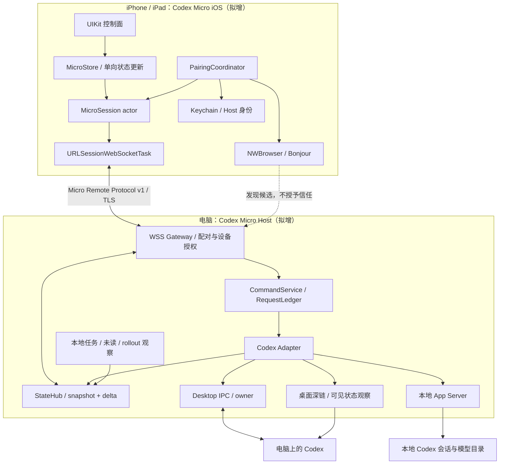
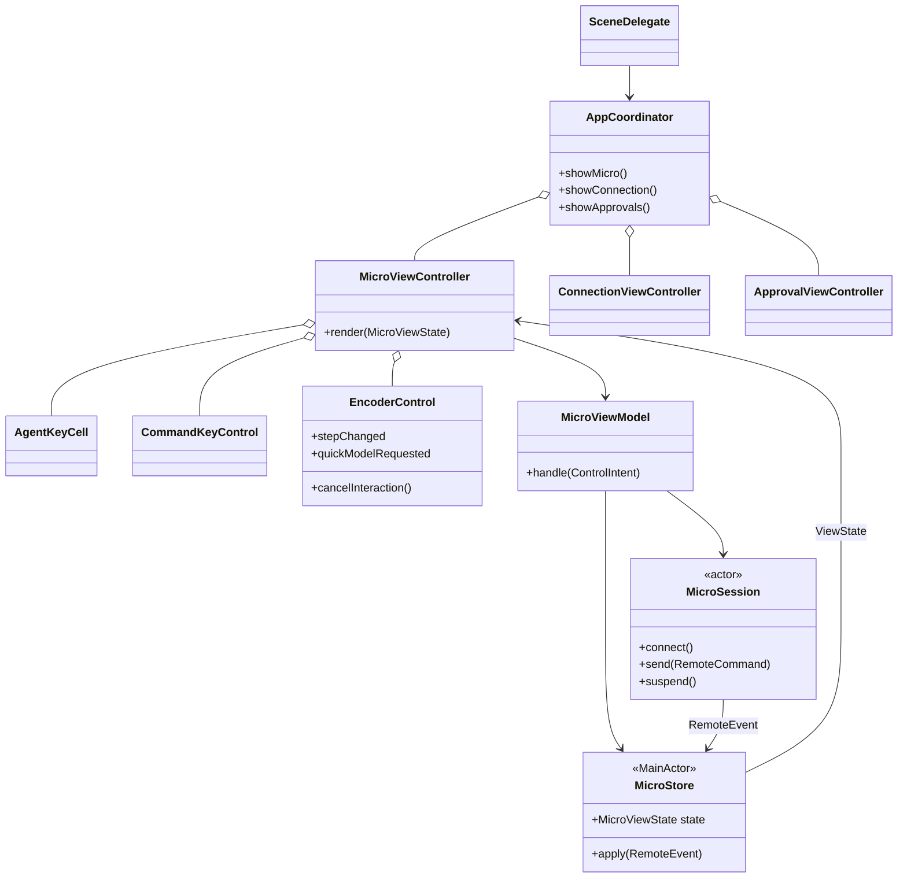
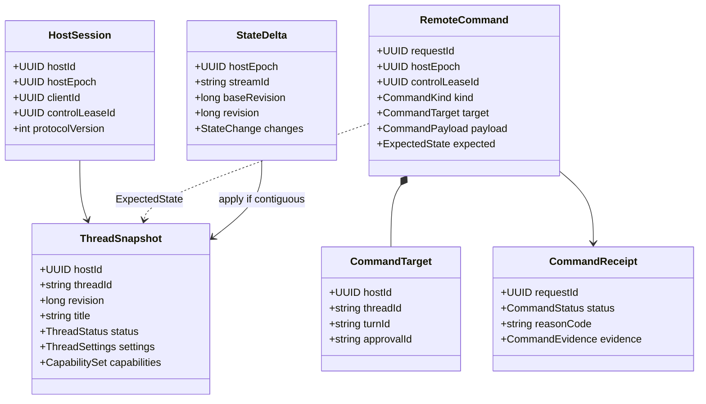
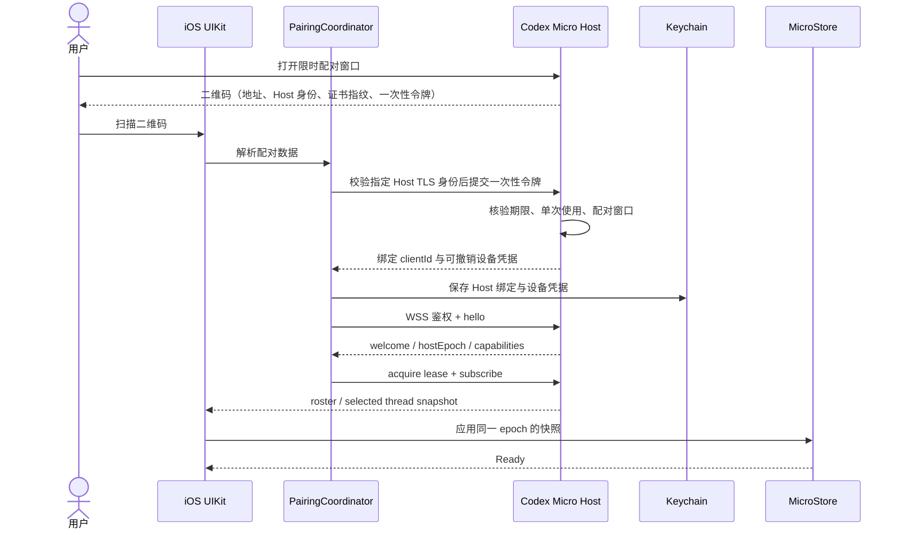
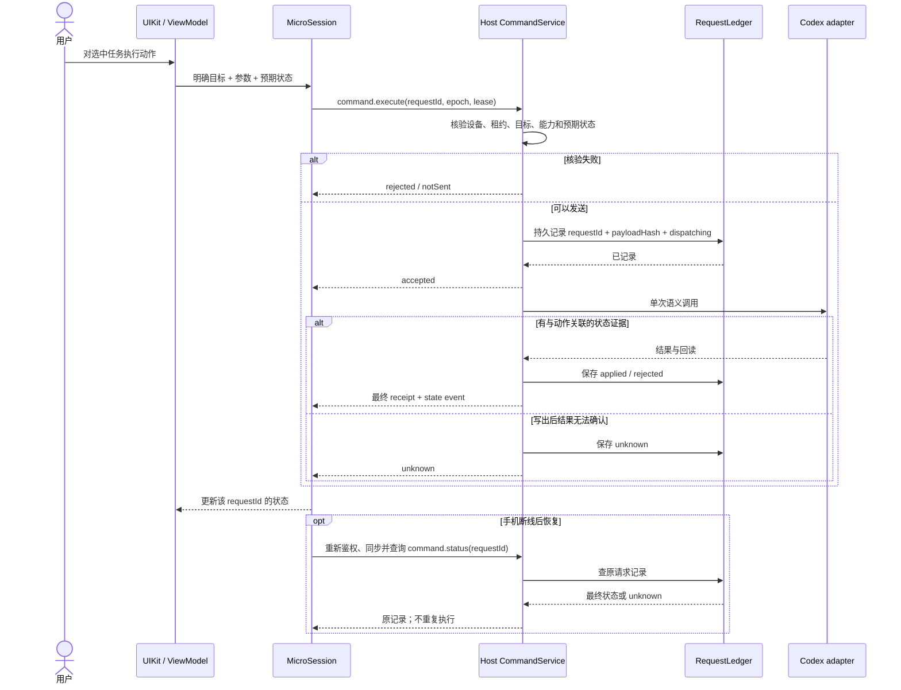
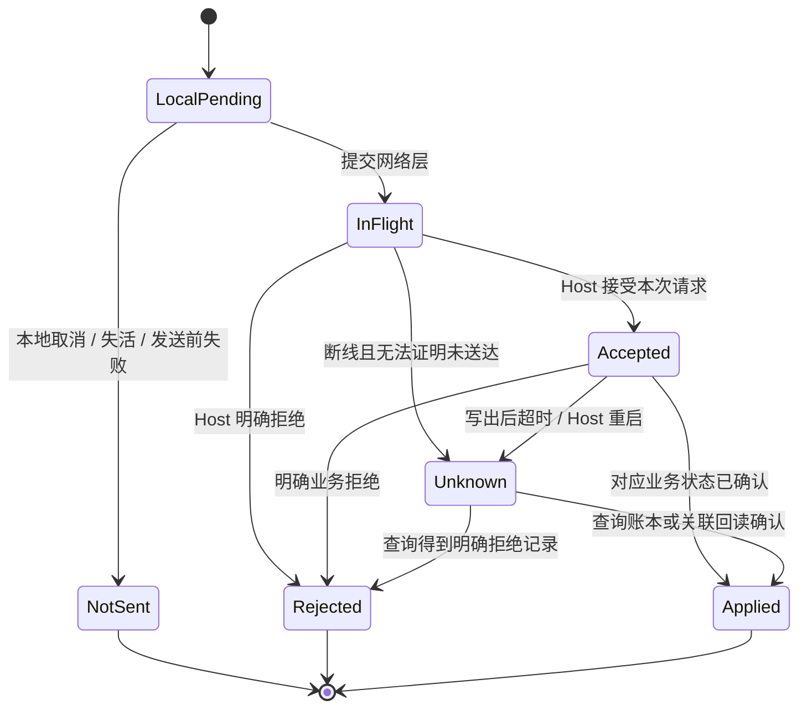
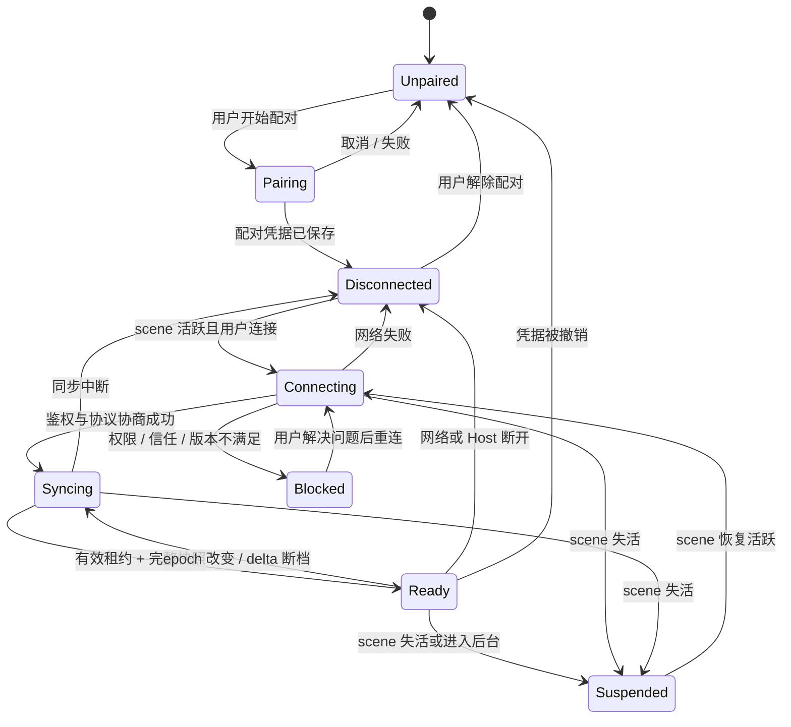

# Codex Micro iOS：UIKit 架构与 UML

> 状态：设计提案，尚未创建 iOS 工程或网络 Host
> 日期：2026-10-03
> 范围：独立 Codex Micro；iPhone / iPad；UIKit 为主
> 源码参考：`5a82309` 及梳理时的工作树；桌面软件控制模块正在迁移

## 1. 版本边界

**iOS 是触摸控制面，Codex Micro Host 是电脑上的配套程序。** Host 连接运行中的 Codex、整理状态并执行命令；iOS 负责配对、选择会话、呈现任务键和发送明确的用户意图。

| 项目 | 首版设计 |
| --- | --- |
| 界面 | UIKit、Auto Layout、Core Animation；程序化视图与 scene 生命周期 |
| 系统基线 | 暂定 iOS / iPadOS 17+，作为项目选择，后续可调整 |
| 设备 | iPhone 优先，iPad 自适应；首版单 scene |
| 连接 | 同一局域网中的配对 Host，WSS；Bonjour 发现、二维码配对 |
| Host | 独立 Codex Micro Host；现有源码可作为 Windows 适配参考，macOS 适配待实现 |
| 产品依赖 | 不依赖 AgentController 的输入、ActionRouter、Domain、窗口或发布流程 |
| 能力策略 | Host 按会话下发能力；iOS 根据实际能力启用操作 |
| 首版之外 | 公网中继、后台持续监控、APNs、原生 HID 仿真、PTT、桌面空白草稿控制 |

现有 Micro 软件链路使用电脑本机的 named pipe、CLI 子进程和桌面深链。这些端点不能直接作为手机网络接口；需要新增 Host 的网络协议层。本文所有 Swift 类型、网络消息和 Host 组件均为**拟增**，已有桌面能力仅作实现证据。

手机保存 `selectedThreadId`；Host 另报 `desktopVisibleThreadId`。两者分别呈现，任何命令都显式携带 `hostId + threadId`，不默认操作“电脑当前那个聊天”。

## 2. 部署与组件视图



Host 对外只暴露有限的 Micro 业务命令；Desktop IPC 的 owner、版本号、私有 JSON 和桌面路径留在 Host。手机不获得任意 shell、任意 IPC method 或任意文件访问入口。Host 的传输层可以跨平台，具体 Codex IPC / 窗口适配仍须按桌面平台实现。

`URLSessionWebSocketTask` 支持 WebSocket 消息及 WSS；协议选择为本项目设计，不代表 Codex 已提供这个服务。[Apple：URLSessionWebSocketTask](https://developer.apple.com/documentation/foundation/urlsessionwebsockettask)

## 3. UIKit 界面与交互

| 区域 | UIKit 实现 | 交互与约束 |
| --- | --- | --- |
| 主控制面 | `MicroViewController` + `UICollectionView` | 六个常用任务键、命令区、旋钮区；更多任务进入列表 |
| 任务键 | `AgentKeyCell` + 自定义 `UIControl` | 轻点选择手机目标；独立的“桌面打开”操作请求电脑导航 |
| 任务状态 | `CALayer` / 图标 / 短状态标签 | 运行、待输入、完成未读、错误、过期；选中光效与状态光效分开 |
| 命令键 | `CommandKeyControl` | Fast、Plan、快捷模型；能力缺失时禁用对应键 |
| 旋钮 | `EncoderControl: UIControl` + 手势识别 | 拖动跨过档位产生离散步进；轻点切快捷模型；取消手势清空待提交步进 |
| 旋钮替代操作 | `UIAccessibility` adjustable + 增减按钮 | VoiceOver 和非旋转操作可调整同一语义值 |
| 模型选择 | UIKit sheet + 模型 / effort 列表 | 来源为 Host 目录；不在手机硬编码模型或档位 |
| 审批 | `ApprovalViewController` sheet | 展示具体请求和决定；多请求逐项选择 |
| 连接 | `ConnectionViewController` | 主机列表、配对、重连、解除配对 |
| 触觉 | `UISelectionFeedbackGenerator` 等 | 档位反馈与结果反馈分开；触摸反馈不代表执行成功 |
| 四向控制 | 可选 `DirectionalControl: UIControl` | 只在确有可用语义绑定时显示；首版不预留无效摇杆 |

任务项使用稳定的 `(hostId, threadId)` 标识，不能以 cell 序号绑定命令。iPhone 竖屏默认 3×2 常用任务键；横屏和 iPad 按可用宽度重排，任务 ID 与选择不变。只呈现必要的标题、数值、状态与控件标签，不新增说明性文案区。

使用 compositional layout 组织区域，以 diffable data source 的 snapshot 更新任务列表；网络状态先进入 Store，再由主线程提交 UI 更新。[Apple：Compositional Layout](https://developer.apple.com/documentation/uikit/uicollectionviewcompositionallayout)、[Diffable Data Source](https://developer.apple.com/documentation/uikit/uicollectionviewdiffabledatasource)

### UIKit 类图



View / ViewController 只处理布局和交互；ViewModel 将输入转换为语义请求；`MicroSession` actor 管理 socket、关联请求和连接世代。`MicroStore` 位于 `@MainActor`，保存已确认状态、待处理操作和过期标记。首版不引入额外状态管理框架。

## 4. 手机与 Host 的协议合同

协议命名为 **Micro Remote Protocol v1**，与 Codex Desktop IPC 的版本独立。数据使用类型化 `Codable` DTO；手机不接收完整内部会话对象，只接收控制面需要的字段。

### 数据类图



`turnId`、`approvalId` 只在相应动作中存在；`CommandKind` 与 `CommandPayload` 使用匹配的枚举分支，不能任意组合。任务键与网络请求均保留原始目标，列表重排或用户切换手机目标不重定向已发出的命令。

| 消息 | 用途与约束 |
| --- | --- |
| `hello / welcome` | 协商协议、Host 身份、epoch、能力版本、消息上限；版本不兼容时不进入 Ready |
| `session.acquire / renew / release` | 获取有期限的控制租约；Host 用自身单调时钟计时，不依赖手机时钟 |
| `threads.list` | 分页读取可用任务，返回稳定 ID；与六个常用键位分开 |
| `state.subscribe` | 订阅 roster 与所选任务；首次返回 snapshot，后续发送带 baseRevision 的 delta |
| `command.execute` | 明确目标、唯一 requestId、类型化参数、必要的预期状态 |
| `command.receipt` | 分别返回 accepted、applied、rejected、notSent、unknown |
| `command.status` | 查询原 requestId 的记录；重连只查询，不重新提交原写命令 |
| `capabilities.changed` | 动态禁用失效能力；旧 capability 不能使新请求绕过 Host 核验 |

模型 / effort / Fast / Plan 下发**绝对目标值**；旋钮的相邻增量在手机端计算为一个目标值。每个任务同类设置至多一个在途请求，后续输入只保留最新意图；前一请求回读完成后重新计算。结果 unknown 时停止队列，不能继续基于乐观状态改写。

Host 的 revision 校验只保护 Host 自己的观察版本，不能假定等价于 Codex 服务端的原子条件写入。适配器复用已有条件字段，并回读实际结果；不支持相应语义时降低能力声明。

## 5. 配对与首次同步时序



Bonjour 仅用于发现。首次信任来自用户扫描电脑上的配对二维码，后续匹配已保存的 Host 身份；证书或身份变化回到配对流程，不接受任意证书。一次性令牌不放入 Bonjour TXT、不作为长期密码；鉴权凭据不放在 URL 中。Host 可以单独撤销某部设备，默认只授予本产品定义的操作。

本地网络访问需声明 `NSLocalNetworkUsageDescription`；浏览指定 Bonjour 服务需列出 `NSBonjourServices`，拟用 `_codexmicro._tcp`。拒绝权限时连接不可用；没有发现服务不等同于用户拒绝权限。发现 API 使用 `NWBrowser`。[Apple：NWBrowser](https://developer.apple.com/documentation/network/nwbrowser)、[本地网络隐私](https://developer.apple.com/documentation/technotes/tn3179-understanding-local-network-privacy)

扫码使用系统相机能力，首次使用时请求相机权限；可预留手动录入同一完整配对材料的入口。普通发现不应额外发送自定义广播或扫描整个子网。

## 6. 命令执行与不确定结果



同一设备与 requestId 只对应同一 payload；冲突 payload 被拒绝。Host 必须先记录 dispatching 再调用 Codex。Host 重启后的未完成记录归为 unknown；这不保证底层 Codex exactly-once，目的是避免 Host 自己盲目重放。账本过期或缺失同样不能证明原命令未执行。

### 命令状态机



`accepted` 不显示成功灯。深链启动只表示打开请求已交付；没有桌面可见状态证据时保留未确认。停止绑定确切 `turnId`，审批绑定确切 `approvalId`，分叉回传新 threadId 后，即使桌面打开失败，也不再执行第二次 fork。

UI 取消、切换目标或退后台都不能撤销已经被 Host 接受的命令；这类请求继续保留记录，恢复后查询结果。发送、分叉、审批、停止均不进入离线队列。

## 7. iOS 生命周期与连接状态机



scene 离开 active 时立即禁止新命令、取消按住与旋钮积累，尽力释放租约并暂停连接。断线时由 Host 租约期限兜底；不能依赖手机最后一个 release 一定送达。此前已经接受的命令仍按上一节处理。

后台只保留缓存呈现，标记状态过期；回到前台先鉴权、取新租约、重建 snapshot，再恢复操作。重连后的 delta 必须匹配 `hostEpoch + streamId + baseRevision`，否则重新同步。不得把 socket 重连成功直接当作业务状态已同步。

UIKit scene 进入后台后可能被挂起或断开，因此首版不承诺锁屏后的持续实时状态，也不以音频等后台模式维持控制连接。[Apple：Managing your app’s life cycle](https://developer.apple.com/documentation/uikit/managing-your-app-s-life-cycle)

## 8. 首版能力矩阵

以下等级是实施顺序，全部尚未接入 iOS。

| 能力 | iOS 语义 | Host 参考与范围 | 阶段 |
| --- | --- | --- | --- |
| 主机连接 | 发现、配对、撤销、重连 | 新增网络 Host 与设备身份 | P0 |
| 任务键 / 更多任务 | 显式选择 threadId | 现有列表与 roster 读取；手机顺序独立于原生 AGxx | P0 |
| 状态灯 | 运行、待输入、完成未读、错误、过期 | IPC 与本地状态观察；区分来源和时效 | P0 |
| 桌面打开 | `desktop.openThread` | 本机深链；与手机选择分别记录结果 | P0 |
| 模型 / effort | `thread.setModel` / `thread.setEffort` | 现有 owner settings 与目录；只使用 Host 返回的可用值 | P0 |
| Fast / Plan | `thread.setFast` / `thread.setPlan` | 绝对布尔目标；Host 转换为真实 tier / mode | P0 |
| 停止 | `turn.stop` | 指定 activeTurnId；手机长按或明确确认 | P1 |
| 审批 | `approval.reply` | 指定单个请求；仅 command / file 等实际支持类型 | P1 |
| 分叉 / Review | `thread.fork` / `desktop.openReview` | fork 用 App Server，Review 用深链；依赖账本与回读 | P1 |
| 手机文字发送 | `turn.startText` | 手机自己提供的文本；显式任务、空闲检查；不代指桌面草稿 | P1 |
| 未读与问题状态 | `thread.setUnread` / 状态订阅 | 后续整合现有观察与写入通道；问答不冒充审批 | P1 |
| 桌面新草稿与模型切换 | 待定义独立 desktop-draft capability | 需要 Host 证明前台 Composer 归属，首版不接入 | 后续 |
| PTT / 语音、Composer 导航、滚动、技能插入 | 待定义 | 现有软件通道未完整提供，不能用触摸 down/up 假装支持 | 后续 |
| 锁屏推送 / 公网远程 | 待定义 | APNs、中继、身份与远程部署是独立范围 | 后续 |

## 9. 工程边界与落地顺序

拟议结构；本轮只落文档，不创建这些 target 或代码文件：

```text
codex-micro-ios/
  CodexMicro.xcodeproj
  App/                    AppDelegate、SceneDelegate、AppCoordinator
  Features/
    Micro/                主控制面、任务键、命令键、旋钮
    Threads/              更多任务与选择
    Connection/           配对与主机管理
    Approvals/            特定请求的处理
  Core/
    Domain/               Thread、Command、Capability、Receipt
    State/                MicroStore、ViewState
    Session/              MicroSession、请求关联、连接世代
  Infrastructure/
    Network/              WSS、Bonjour、TLS 身份校验
    Security/             Keychain、配对凭据
    Persistence/          用户布局与只读缓存

codex-micro-host/
  Gateway/                配对、WSS、授权
  Commands/               命令核验、调度、RequestLedger
  State/                  StateHub、snapshot/delta 投影
  Codex/                  Desktop IPC、App Server、状态观察
  Platform/               Windows；macOS 后续适配

protocol/
  micro-remote-v1/        消息定义、能力语义、版本规则
```

Swift Domain 不依赖 UIKit / 网络；UIKit 只通过 ViewModel 与 Store 交互。Host 使用独立合同，不引用手柄产品的动作类型。现有桌面实现可提取为 Host 内部适配代码，但当前 C# 程序集仍有其他产品依赖，不能直接等同于独立 Host。

| 顺序 | 工作 | 交付边界 |
| --- | --- | --- |
| 1 | 冻结 v1 消息、目标与结果合同 | 手机和 Host 对 requestId、epoch、revision、能力有一致定义 |
| 2 | UIKit 控制面原型 | 用明确标记的静态演示数据完成任务键、旋钮、sheet 与自适应，不伪装真实连接 |
| 3 | 最小 Host 与配对 | 单机配对、设备撤销、WSS、租约、roster snapshot；先不开放写操作 |
| 4 | 状态与设置闭环 | 任务状态、桌面打开、模型 / effort / Fast / Plan；以回读确认结果 |
| 5 | 特定请求操作 | 账本、断线恢复后再开放停止 / 审批 / 分叉 / 文字发送 |
| 6 | 设备和平台扩展 | iPad 细化、macOS Host、语音与远程连接按独立能力推进 |

## 10. 现有源码参考

这里只记录可借鉴的桌面实现，不构成 iOS 或 Host 的项目依赖。

| 内容 | 当前工作树路径 |
| --- | --- |
| owner 发现、设置、停止、审批、显式文本发送 | [KeypadController](../../src/AgentController.Adapters.Codex.Software/KeypadController.cs) |
| 当前用户 named pipe 与 Desktop IPC framing | [CodexPeerClient](../../src/AgentController.Adapters.Codex.Software/DesktopIpc/CodexPeerClient.cs) |
| 本地目录与 fork | [LocalAppServer](../../src/AgentController.Adapters.Codex.Software/AppServer/LocalAppServer.cs) |
| Micro 控件到软件动作映射 | [SoftwareMicroTransport](../../virtual-micro/src/AgentController.MicroSurface.Wpf/SoftwareControl/SoftwareMicroTransport.cs) |
| 模型状态与 revision 处理 | [CodexModelToggleService](../../virtual-micro/src/CodexMicro.Desktop/Services/CodexModelToggleService.cs) |
| 问答状态订阅 | [SoftwareQuestionObserver](../../virtual-micro/src/AgentController.MicroSurface.Wpf/SoftwareControl/SoftwareQuestionObserver.cs) |
| 桌面选择观察的局限 | [CodexSelectedThreadReader](../../virtual-micro/src/CodexMicro.Desktop/Services/CodexSelectedThreadReader.cs) |

本轮只完成架构与 UML，未创建 Swift 工程、启动 Host、开放网络端口、编写测试或运行 UI 验收。
