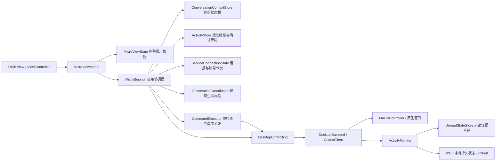
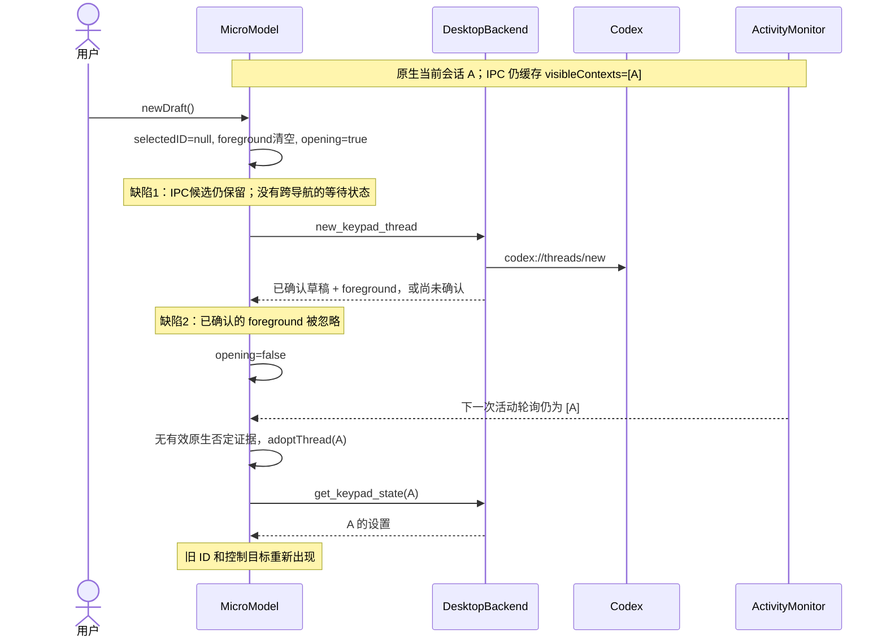
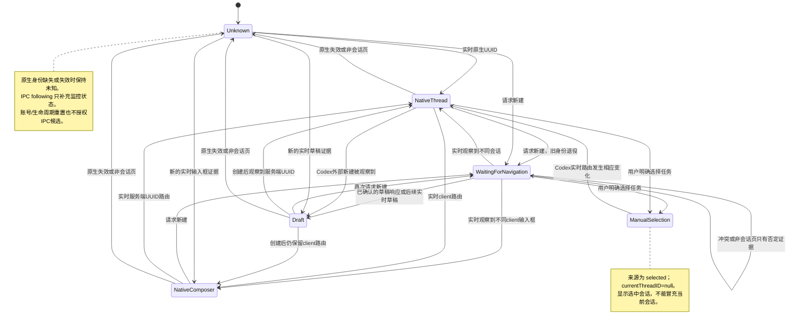

# Mac 当前会话 ID：数据来源、状态机与新建竞态

记录时间：2026-10-05。本文来自当前源码，不是产品运行验收报告。

原有 `ios-uikit.zh-CN.md` 的 UML 描述 iOS 配对、命令和生命周期，并没有描述 Mac 当前会话 ID。下面补齐 Mac 链路，并区分已打包的 preview.32 缺陷与本次源码修复。

## 身份不是一个变量

| 字段 | 含义 | 不能代表什么 |
| --- | --- | --- |
| `threadId` / UUID | 服务端已创建会话的持久身份 | 新草稿尚未拥有的 ID |
| `clientThreadId` | Codex 前端 composer 身份，形如 `client-new-thread:…`；创建会话后仍可能保留 | 不能直接去掉前缀当作服务端 UUID，也不能据此前缀认定仍是空草稿 |
| `targetToken` | 本次原生窗口、输入框及状态的控制凭证 | 持久会话 ID |
| `visibleContexts` | IPC `thread-stream-following-changed` 汇总的订阅/可见候选集合 | 当前获得焦点的窗口或新建导航完成证明 |
| `selectedID` | 面板读取/控制目标；可能来自自动观察，也可能来自用户手动选择 | 不带 `contextSource` 时不能声称是当前会话 |
| `currentThreadID` | 仅在 `foreground` 来源下投影的 UUID，或经过核验的 client→server 只读映射 | 手动选择的 ID 或 IPC following 候选 |
| `displayedThreadID` | 设置面板显示/复制的 ID；包含明确标注为“选中会话”的手动选择 | 标签不能省略来源 |

草稿的正确 ID 是空。识别到了新草稿后，Fast / Plan / MIND / 模型使用该输入框的原生 token；不能借旧 UUID 继续操作。

## 当前 MVVM 边界

### 2026-10-05：授权后识别间歇失败与 CODEX 键失效

实际运行的 Debug 程序 PID 84125 于 22:50:15 记录 `trusted=true`；原生观察同时返回 `accessibility=true`。此次问题已经越过系统授权阶段。22:50:15 的识别失败原因是 `Bring the target Codex window or Micro to the front.`；22:50:27 已识别 thread 和输入框，但 `modelPickerAvailable=false`，22:51:18 控制日志再次报告找不到模型选择器。22:59:52 又出现 `accessibility=true`、输入框及容器存在、`modelPickerAvailable=false`，此时状态变成 `available=false kind=unresolved`。原始选取记录保存在 `dist/macos/conversation-recovery/runtime-evidence.log`。

查明并修改三处代码路径：

| 原因 | 修改 |
| --- | --- |
| 只读观察复用了操作前的前台限制；切到其他应用即拒绝读取当前 Codex 窗口 | `NativeUIAccess.observe` 允许后台观察及只读 client 关联复核；实际操作的 `capture` 仍重新核验焦点和精确窗口，日志补充真实焦点、路由可用性与选择状态 |
| 默认 CODEX 键先取得 composer token 才能进入唤起分支；无对话、权限或布局尚未加载时没有恢复动作 | `MicroSession.prepareKey` 为默认 CODEX 键独立选择唤起或严格提交；`activate_keypad_app` 通过 `NSWorkspace.openApplication` 打开实际运行的应用，独立于 AX、IPC、模型列表和会话 ID。唤起完成后仅重新观察，不重放提交 |
| 模型选择器的别名和属性匹配落后于当前应用 | 补充简体/繁体 ChatGPT 模型选择器及繁体推理强度标签，匹配同一按钮的 Title、Description、Help 和其他辅助功能字符串，继续要求输入框容器内唯一匹配 |

标签来源是本机已安装 Codex `app.asar` 的前端及中英文资源：`chatgptConversations.modelPicker.ariaLabel`、`composer.intelligenceDropdown.tooltip`、`composer.modelPicker.selectEffort.label`。按钮同时存在可见标题和独立 `aria-label`；旧版 `node.name` 优先使用 Title，会遗漏其他属性。该兼容性缺口与运行日志中 picker 缺失相符，但没有采集或操作真实 AX UI 来声称已完成端到端验收。

默认 CODEX 键未具备提交条件时只唤起应用，后台唤起不要求输入框非空。已明确清空、重映射的槽位保留用户配置。逻辑 `composer.submit` 继续要求有效 token；正常前台提交仍走原先的目标与输入框复核。没有恢复 IPC following 回填当前 ID，没有将后台观察当作 Codex 已获焦点或会话已读。

候选构建输出到 `dist/macos/conversation-recovery/`。遵循仓库限制，不新增测试代码，不触发真实 UI 测试，不替换运行中的 Xcode Debug 程序。

验证结果：352 项既有 Swift 回归、45 项打包后隔离进程场景通过。Universal 主程序与原生桥接、严格签名、ZIP、许可文件、本地化资源、插件 15 文件同步检查通过。候选与当前 Debug 使用相同的稳定 Apple Development designated requirement。最终源码及产物哈希见候选目录 `validation.json`。这些回归没有覆盖新增唤起分支的真实 macOS 效果；后台窗口观察、当前版本 AX 匹配及唤起恢复仍需使用新运行进程验收，不能用旧进程表现验证新源码。

### 后续整改：身份、能力、观察与恢复分别管理

上一轮只修补匹配和入口，不代表整条链路已完成。后续源码进一步处理以下耦合，候选证据目录为 `dist/macos/identity-recovery/`：

- `MicroShared/NativeObservation` 将只读 thread、draft、client、无路由 composer 和 unknown 明确分类。`observationToken` 绑定原生窗口与路由，不依赖编辑内容、模型按钮或模型设置；`targetToken` 仍绑定实际操作目标。只读 token 不能代替操作 token。
- client→server 关联的前后两次窗口复核使用只读 token。模型按钮消失不再清除已核验的 client 身份；没有输入框或模型能力时仍不会得到对应写权限。未知路由的旧 composer 回退继续要求更强控件证据。
- 模型子菜单与外层按钮共用模型标签集合，读取同一控件的辅助功能字符串。发送、听写、Plan、模型／Power 分别根据所需能力判断；client 映射 UUID 仍不得作为发送或服务端写入目标。
- 目录失败仅撤销服务端派生状态与 client 关联，保留独立、仍新鲜的原生路由。保存上次确认的服务上下文，区分首次连接、同账号重连与真实账号／作用域变化；后者仍清除完整上下文。
- `ObservationCoordinator` 独立管理三类轮询及生命周期。读取耗时计入间隔，唤醒事件合并到对应工作循环。权限变化、Codex 启动／退出／激活和 Micro 激活会触发观察；不通过多开轮询任务来加速恢复。
- `ServiceConnectionState` 统一持有当前服务上下文、上次确认的账号和连接代次；断线保留账号证据及未读确认屏障。活动读取必须匹配连接代次，断线后不能重新接纳旧流。目录响应的唯一性检查先于连接状态提交。
- `CommandExecutor` 统一单次设置、连续按键、旋钮的预检查与分发。`PreparedControlCommand` 将实际 native lease 与精确服务端 thread 权限分开，拒绝将 native composer 的映射 UUID 变成写入目标。每次异步预检查返回后重新验证生命周期、选择代次与连接状态，操作不自动重试。
- 前台读取与 client 关联核验采用独立请求代次。旧观察过期只会撤销旧状态，不再使正在返回的新观察失效；手动选择、真实操作及上下文变化仍会使旧读取失效。关联查询结束后用实际新观察恢复 composer，再提交关联，服务端 UUID 本身不能恢复当前身份。遍历完成后再次核对实际窗口，拒绝把切换窗口过程中的混合数据投影为当前状态。
- 新草稿和全局页面导航只清理路由及临时活动，不再清除同账号的未读确认屏障；只有会话停止、明确无效的账号上下文或确认账号变化才重置整个活动 store。
- 应用唤起使用独立任务，不依赖服务写入是否仍在等待。Launch Services 回调有六秒超时及取消处理；其后最多三秒确认应用激活且窗口服务器报告可见窗口。唤起期间禁止新的提交，既有原生写入仍逐步复核自己的精确窗口。
- 原生树建立一次 `AXTreeIndex`，查询按钮子树时不再反复扫描整段聊天。主 composer 选择排除 `app-shell-tab-panel-…` 面板；聚焦窗口属性不是 AX 元素时，才使用经类型检查的主窗口回退。
- 观察结果包含失败分类、来源、读取耗时、节点数、PID、窗口诊断指纹；指纹不参与授权。慢读取日志限频。每次实际构建把源码 SHA-256、构建时间、配置和架构写入桥接资源，运行时记录这些信息，区分旧进程与新源码。

整改中既有 `ClientAliasReplayTests` 捕获了真实回归：待核验 alias 的中间投影清除了原操作租约，导致每次复核后 token 都变化，连续 Fast／Plan／Power 操作被拒绝。修复是在只读核验期间仅内部保留仍匹配的操作租约，公开 `targetToken` 仍为 null；核验成功后才恢复能力。原失败日志 `swift-tests.log` 保留，未修改测试断言；修复后 13 项 alias 回归通过。

多窗口边界仍须如实记录：每个当前窗口的 AX document／sidebar 可独立识别，但 Electron 日志 windowId 尚无可信的原生 AX 窗口映射；多个日志 owner 时继续拒绝补充路由。不能拿窗口标题、相邻时间或位置猜测对应关系。2026-10-06 用户明确要求继续修复并限制每种场景最多一种 E2E，此后开始新增针对性回归。真实 UI 工具明确拒绝访问 `com.openai.codex`，跨应用验收因此受工具限制；不以其他技术绕过。

### 整改待办与完成标准

“代码已改”与“真实场景已验收”分开记录。以下项目不因已有测试全部通过就自动关闭。

| 编号 | 具体工作 | 当前状态与尚缺证据 |
| --- | --- | --- |
| 01 | 模型按钮缺失时保留当前会话身份，按具体能力禁用操作 | 身份与操作 token 已分离；缺按钮、缺输入框专项组件回归通过；只读回退补上 client 路由 |
| 02 | 目录、IPC、账号故障不得抹掉独立原生路由 | 连接状态已拆分；断线保留当前路由、同账号重连和换账号屏障组件回归通过 |
| 03 | 覆盖外层模型按钮、模型子菜单及中英文 AX 属性 | 已统一标签集合并补齐繁体“選取模型”；组件回归通过，但新包 PID 94058 仍报告 picker 缺失，实际匹配缺口尚未定位；真实 AX 核对受工具限制 |
| 04 | CODEX 恢复键不依赖会话、AX 权限和服务请求 | 独立任务、取消、回调超时与可见窗口确认已实现；无身份和布局的恢复、连按、回调缺失／取消／重复组件回归通过；最小化实测受工具限制 |
| 05 | 修复慢读取与两秒过期互相阻塞的恢复竞态 | 慢原生读取和 client 核验过期组件回归通过；真实长对话延迟仍待测量 |
| 06 | 主输入框、侧聊天、多个窗口归属明确 | 完整扫描与回退统一排除侧聊天／嵌套网页；移除 600 像素限制并通过高输入框、重复主输入框回归；多窗口日志到 AX 的可信映射仍未解决 |
| 07 | 启动、授权变化、睡眠唤醒能自动恢复观察 | 权限、轮询唤醒合并和停止后迟到返回组件回归通过；新包启动权限为 true，但当前身份仍未知，启动验收未通过；其他生命周期分支受工具限制 |
| 08 | 新草稿、快速切换、旧异步返回不能恢复旧会话 | 新增人工选择期间迟到观察、预检查期间上下文失效组件回归，保留既有生命周期场景 |
| 09 | 未读展示与确认记录不被观察、断线或页面导航清空 | 新草稿→全局页面→断线→同账号重连→换账号组合组件回归通过；不会以此冒充持久化或真实 UI 验收 |
| 10 | MVVM 按身份、活动、观察、连接、命令职责拆分 | 已有独立 store/coordinator/executor；Session 负责交互编排与状态提交；新增可注入的 Launch Services 回调边界和纯输入区归属计算 |
| 11 | 能从日志区分授权、路由、控件、超时与运行版本 | 已有失败分类、耗时、来源和构建指纹；PID 94058 的真实记录确认新源码和授权正常，尚不能区分 picker 缺失、禁用或重名的实际 AX 原因 |
| 12 | 构建产物与源码一致，完成回归和真实场景验收 | 本轮完整 371 项 Swift 和最终包 45 项进程场景通过，Micro 启动显示验收失败；`dist/macos/recovery-verification/validation.json` 记录分层结果，不将任务整体关闭 |

根因记录还包含本轮主动纠正的两个实现问题：连续设置队列在异步预检查返回后原先没有重新核对选择代次；新观察唤醒曾与菜单刷新重用同一事件名，使原菜单分支不可达。现已分别补上执行边界校验并使用独立的 `observationChanged` 事件。构建告警用于检查 UI 编译目标，不能只依赖 SwiftPM 的模型测试。

前一阶段验证（2026-10-06，`identity-recovery`）：连接与命令拆分后完整既有回归 **352 项、0 失败**；最后的页面导航屏障及 client 核验过期修正后，相关既有回归 **170 项、0 失败**；Universal 候选隔离进程 **45 场景通过**。最终编译无源码告警，Xcode 仅提示无 AppIntents 依赖而跳过元数据提取。主程序与桥接均为 arm64／x86_64，签名要求与既有稳定 Debug 一致，ZIP、资源与 15 文件插件同步检查通过。源码指纹 `f5cb9aa6fcb882866da618ebc699a08ee409bf2df28b6c462450ba70ba007098` 与候选资源一致；分阶段覆盖范围、产物和日志 SHA-256 记录在 `dist/macos/identity-recovery/validation.json`。该阶段未替换运行应用、未启动候选 UI、未新增测试代码；这些是历史阶段边界，不代表下面最新阶段的结果。

后续根因修正：`NativeComposerScope` 在语义边界内定位唯一主输入框和控件，完整扫描与聚焦回退共用排除规则；没有模型按钮时保留最近的有效操作容器，不向上吸收会话正文或页头按钮。聚焦回退在读取后重新核对窗口与输入框，拒绝跨窗口混合证据。回退状态单独签发仅用于读取的短期 receipt，可保留精确 client 路由并完成只读关联，永远不产生 `targetToken`。原来只投影 `route.threadID` 的实现会在 AX 超限、路由仍为 client 的情况下丢掉可用身份。

### 2026-10-06：新增回归与新进程复核

`recovery-verification` 的最终源码完整通过 **371 项 Swift 测试**，包含新增的 19 项组件回归；最终 Universal 包复用既有 `process_e2e.py`，**45 场景全部通过**。无源码编译告警；双架构、严格签名、ZIP、本地化与许可资源、15 文件插件同步均通过。构建资源和当前源码指纹一致：`ee61d26508a8be62421199baf27d613fddf43bc5c378f7338a00aca79c2c1249`。

运行复核没有通过。原 Debug PID 91342 的源码指纹属于前一阶段 `f5cb9aa…`，不能称为最初未修复版本；它曾显示精确当前 ID，随后又丢失。本轮退出该进程并启动上述最终包，PID 94058 于 00:33:15 记录新指纹和 `trusted=true`。随后仍为 `available=false kind=unresolved selectionKnown=false composerAvailable=true composerContainerAvailable=true modelPickerAvailable=false`，路由来源为 `native-sidebar-or-home`。Micro 自身界面初始化后也没有显示当前会话 ID。因此启动识别缺陷仍开放，不能归咎于未授权或运行了旧代码。

既有 Codex 日志元数据只有一个 owner，最后记录为聊天路由（07:12:10 UTC）；这排除了“本次是多个日志 owner 冲突”的断言，但不证明该 owner 对应当前 AX 窗口。完整观察没有采用日志路由的具体拒绝条件、模型按钮实际 AX 属性／禁用／重名状态还缺真实证据。工具明确拒绝访问 Codex，不能改用其他 UI 通道采集；窗口切换、最小化恢复及实际 CODEX 按键未执行。新包留在运行，未修改 TCC 或发出业务操作。失败日志、Micro 界面结果及分层验证记录保存在本轮输出目录。

### 展示数据流

UIKit 与设置页只持有 `MicroViewModel`。ViewModel 在主线程下一次调度时合并观察通知，生成一份完整 `MicroViewState`；视图不再直接观察原来几十个字段的中间状态。动作经过 `MicroSession` 执行并在派发前重验目标。`MicroModel` 仅为既有调用方和场景回放保留类型别名，不再是界面依赖。

`MicroSession` 负责传输、轮询、目录、设置队列和操作生命周期，不决定身份仲裁与未读证据优先级。`ConversationContextStore` 独立持有原生观察、显式选择、client 关联和待确认导航。`explicitTargetID` 与带来源/观察时间的 `observedCurrentIdentity` 分开，`NativeLease` 单独校验有效期；`selectedID` 只是兼容的目标投影。IPC following 只保存在 `ActivityStore.visibleCandidates`，不能产生当前 ID 或写入权限。

原生观察保留 `nativeRoute`、`readOnlyRoute`、`verifiedClientBinding`、`nativeComposer` 来源。日志只读身份可以显示 ID，但不能产生原生控制租约。client/server 关联只在账号、存储、精确 server 记录和原生窗口复核后用于展示；设置继续使用 native token，不会把映射 UUID 升级为发送、Stop、审批或 Fork 目标。

绿灯投影通过独立的 `focusVerifiedCurrentID`：新鲜、原生可用、Codex 物理聚焦且精确路由匹配时隐藏当前会话的未读灯；同样允许已验证 client 关联参与这个非破坏性的投影。Micro 获得焦点、只读日志、手动选择、冲突和观察过期均不隐藏。`TaskLampPresentation` 保存原始灯态、显示灯态、未读来源/revision、活动 revision 和遮蔽原因，不写入已读状态，也不改变优先级排序。错误、审批、问题和运行态不被遮蔽。

## 本轮缺陷根因与修复

| 缺陷 | 根因 | 修复边界 |
| --- | --- | --- |
| 标记未读后绿灯被旧 IPC 关闭 | IPC revision 在投影时丢失；面板只乐观改色 | `UnreadStateStore` 在已确认持久化写入后建立屏障，桥接返回 context/revision 回执，面板拒绝更旧的活动快照 |
| Codex 已读后旧 IPC 仍维持绿灯 | `IPC > 本地文件` 固定优先级无法表达时间和因果 | 持久化成员变化成为屏障；IPC 同值确认后才交还实时流，标题/模型等无关 patch 不解除屏障 |
| 当前 client 映射与灯光判断分叉 | 灯光只接受直接 UUID 路由 | 身份层输出独立的焦点确认 ID，允许同窗口、同 token、同账号且两秒内的精确关联参与展示 |
| 活动或原生旧应答覆盖较新的观察 | 生命周期未变化时，两个读取可能乱序返回 | 分别校验请求序号，活动层额外拒绝较低 revision；错误返回也经过同样检查 |
| 隐藏/重开后状态被旧任务清理覆盖 | 旧任务的 `defer` 无条件清除 busy/task 字段 | 清理必须匹配 lifecycle；ViewModel 等待上次传输关闭再启动新轮询 |
| 界面快照落后于新槽位/绑定时捕获新动作 | 展示合并到下一次主线程调度，动作却直接读取最新状态 | ViewModel 比较显示中的槽位身份、作用域与键帽/绑定后才捕获动作；变化时拒绝本次输入 |
| UI 观察多个字段的中间组合 | 直接订阅大模型的逐字段通知 | UIKit 消费 ViewModel 合并后的完整展示值；最多投影 14 个可见灯，避免大目录逐行重复计算 |
| 重新订阅后，新未读无法出现 | 首次持久化读取及重连被错误地升级为确认屏障 | P32 及失败现场确认 revision 已推进到 5，但仍卡在持久化 false；只有实际持久化变化和人工确认建立屏障，重连只撤销流来源 |
| 旧 IPC 回填用例失败 | 用例仍要求已被撤销的 visible 身份 | 按本轮用户授权，仅修正该既有用例的名称与断言，未增加用例 |

未读证据携带来源、本地事件 revision、观察时间、stream generation 与 stream revision。首次持久化读取只是基线，不能证明比 owner 快照更新；此时使用已核验 owner 的实时状态。已观察到的持久化变化及人工确认才建立一致性屏障。重连保留真实屏障，但不会凭空创建屏障。字段被删除时撤销该流的未读证据，回退到可用的持久化证据或未知。revision 只在对应 context 内比较，不把文件时间戳与 IPC revision 当成同一时钟。重连清除流证据，账号/存储上下文变化清除全部身份与活动状态。人工未读确认前后还会复核账号身份与持久化内容。

以下 preview.32–34 时序与验证记录是历史根因证据；其中 `MicroModel` 对应本轮拆分前的应用模型。

## preview.32 中复现的错误时序

另一条路径不需要按 Micro 的 NEW：Codex 新建后，Mac 曾观察到草稿，但下次原生读取失败，或该观察超过两秒；preview.32 会丢失否定权，旧 IPC 候选再次变成当前 ID。

旧测试只检查 `newDraft()` 清空 ID 的瞬间，或直接提供一个完整草稿快照，没有继续推进“导航结束→旧 IPC→原生读取失败”的生命周期。它们通过不能证明实际新建链路正确。

## 本次修复后的状态 UML

进入新建等待状态时，清空原生观察、client 映射、可见集合和旧设置，并提升 `observationEpoch` / `selectionVersion`。旧活动应答、旧原生成功或失败应答都不能覆盖新状态。等待没有自动超时回填旧 ID；后续原生证据或用户明确选取才能决定目标。已确认草稿的响应直接交接给 `reconcileCurrentContext()`，不再等待另一次轮询碰巧读到它。

`nativeSelectionObserved` 记录身份来源的优先权，不缓存永久可用的目标。它阻止旧 IPC 重获优先级，但过期的原生 token 不因此变成有效凭证。

## 控制派发与有效期

`ControlTarget` 捕获目标、`selectionVersion`、`lifecycle` 和原生 token。自动观察的持久 UUID 操作在写入前重新观察原生路由；IPC following 不再生成当前目标。草稿与原生输入框操作在 `MacUIController` 中重验窗口、输入框、token、设置预期值，client/server 别名还要经过账号和绑定复核。手动选中的任务走明确选中语义，设置页标签也相应变化。

preview.34 的首页证据兼容输入框为主页内容兄弟节点的布局：只有同一原生 WebArea 中的唯一主页容器、输入框、添加／发送控件和唯一模型选择器同时存在时，才使用 `shell-footer` 证据。嵌入 WebArea 和 `app-shell-tab-panel-` 输入框不能借首页证据获得草稿身份。证据仍交给 `CurrentRoute` 处理冲突、远程 host 和项目作用域，不能从一个类名直接产生持久 UUID。

原生读取失败返回具体 `reason`，导航结果保留最后一次 `foreground` 和失败原因。辅助功能拒绝立即停止这轮导航确认，650 ms 观察循环仍可在用户完成授权后重新读取；不会重放导航或写操作。状态分类、输入框／控件可用标志和首页证据来源写入去重日志，不记录输入内容或控制 token。

### 2026-10-05 启动读取失败：旧授权与新签名不匹配

21:49 启动的 Xcode Debug 进程 PID 77938 使用 Apple Development 证书（团队 `6ZBP55CAH3`），主程序和 MicroDesktop 桥接通过 `codesign --verify --deep --strict`。但 TCC 在 21:49:46.732 明确记录 `Failed to match existing code requirement`：辅助功能授权仍要求旧临时签名的 cdhash `03a77c00ffdf1206898e177a020b0d6698972103` 或 `cb9764fc3ae4cfedcf40d0166bf83d6e9055c764`，与当前证书签名的 designated requirement 不符，结果为 `authValue=0, authReason=5`。21:49:48.086 的应用日志随后记录 `available=false accessibility=false kind=unresolved`。

这次启动失败发生在身份解析之前。修正签名配置不会迁移系统里已经存在的旧授权；应在系统设置的辅助功能列表移除旧条目，重新添加实际运行的 Debug 应用并启用，再重启 Micro。实际路径由当前进程命令确定，位于 Xcode DerivedData 的 `Build/Products/Debug-maccatalyst/Codex Micro Monitor.app`，不能误选另一个同名打包副本。后续本机运行继续使用已固定的开发者证书；临时签名候选包仅用于隔离构建验证。

本次依据现有系统日志和签名进行只读诊断，没有操作系统权限或执行真实 UI 测试。自动化场景通过不能证明 TCC 已授权，恢复状态须以实际进程的新观察结果为准。IPC following 回填会掩盖此类读取失败，不能用来恢复当前身份。

面板的模型/effort 数据来自精确 `get_keypad_state(UUID)` 或当前原生输入框；活动流可更新已选目标的设置，但不能据设置数据选择新的 ID。`get_keypad_state` 回包须匹配选择版本和生命周期。

## Windows 对照与验证边界

Windows `CodexSelectedThreadReader.TryReadDocumentThreadId` 优先读实时 Document Value，排除 bootstrap 启动路由；读到首页/设置页时返回“路由已知、threadId=null”，从而阻止标题回退。Mac 同样需要保留否定证据的优先权，不能在轮询空隙重新相信旧 IPC。

新增 `CurrentIdentityLifecycleTests`：AB01 旧原生/IPC连续返回；AB02 原生不可读；AB03 采用已确认草稿响应；AB04 外部新建后读取失败；AB05 草稿观察过期；AB06 延迟导航与回到旧会话；AB07 手动选择；AB08 旧原生错误晚到；AB09 旧活动失效应答晚到；AB10 新草稿 Fast/Plan/MIND；AB11 已知原生身份丢失。

首批 AB01–AB07 在修复前跑了 7 项，其中 6 项失败，共 40 处断言失败。日志保留于 `dist/macos/parity-current-identity-before-fix.log`。这些是正式 `MicroModel` + 受控 Desktop 边界的生命周期回放，不是实际 Codex 的 E2E 验收。

首轮修复后 AB01–AB11 全部通过，当时完整 Swift 测试为 345 项、0 失败；对应轨迹和记录保留在 `dist/macos/parity-current-identity-replay.jsonl` 与 `parity-current-identity-validation.json`。随后增加 AC01–AC03，直接运行正式 MicroModel → DesktopBackend → MacUIController：新建确认后四类设置、未确认导航后的旧原生/IPC 连续返回、已确认草稿后原生路由失效。该阶段完整 Swift 测试为 348 项、0 失败，新轨迹在 `dist/macos/preview.33/`。两个层级都替换了外部系统边界，没有操作真实 Codex。

Windows `MainWindow.Software.cs` 还用 `_softwareNavigationPending`、目标和选择代次维护待确认导航，控制前检查待确认标记。Mac 此次补齐对应的等待和代次屏障。只读取 `CodexSelectedThreadReader` 无法解释整个身份维护流程。

后续 AB12–AB14 / AC04 又覆盖了非会话过渡页和错误状态交接。旧条件会把 `conflict` 等不同 routeKey 当成导航已完成，下一次读取旧路由即可恢复旧 ID；修复前 AB12、AB13、AC04 共 20 处断言失败。现在只允许已确认草稿、不同的精确 UUID 或已验证原生输入框解除等待。迟到的确认仅清除这次导航留下的错误，不覆盖随后其他操作的错误。18 个 AB/AC 定向测试通过；失败日志为 `dist/macos/preview.33/navigation-gaps-before-fix.log`。

2026-10-05 检查时，PID 41973 从 `dist/macos/universal/Codex Micro Monitor.app` 运行，路径上包版本是 `1000.32`。preview.33 候选已单独构建到 `dist/macos/preview.33/universal/`，没有替换或重启该进程；后续进程检查已找不到它，不能再称其仍在运行。preview.32 的包验证记录仍属于旧包，不用新候选测试结果覆盖它。

源码入口：`apps/macos/Sources/CodexMicroMac/MicroModel.swift`、`MicroCore/CurrentRoute.swift`、`MicroCore/ActivityMonitor.swift`、`MicroCore/ClientThreadBinding.swift`、`MicroDesktop/MacAccessibility.swift`、`MicroDesktop/MacUIController.swift`、`MicroDesktop/DesktopBackend.swift`。显示入口是 `CodexMicroMac/SettingsView.swift` 的当前上下文区域。

## 本轮验证记录

独立输出目录为 `dist/macos/mvvm-refactor/`，不覆盖历史候选。`baseline-swift.log` 保存重构前 352 项测试中那条旧 IPC 回填用例的两处失败。`process-e2e-before-baseline-fix.log` 与 `process-e2e-before-reconnect-fix.log` 保存本轮 P32 捕获的屏障缺陷及首次修复未解决的证据。通过现有用例的 post-mortem 调试读取到 source=persistent、value=false、awaitingAgreement=true、streamRevision=5，最终定位到重连把基线升级为屏障；未改写 P32 用例来绕过失败。`swift-tests.log`、`package.log`、`process-e2e.json` 和 `plugin-sync.log` 分别记录最终回归、Universal 构建、隔离进程验证与插件镜像检查。场景回放通过不等于真实 Codex UI 验收；本轮没有 UI 自动化、实际窗口输入或系统权限操作。候选使用临时签名，仅作本地构建验证，未安装、发布或改变运行中的应用。

新增源码入口：`CodexMicroMac/MicroViewModel.swift`、`MicroSession.swift`、`ConversationContextStore.swift`、`ActivityStore.swift`、`PanelModels.swift`，以及 `MicroCore/UnreadStateStore.swift`。现有 `ActivityMonitor.swift` 和 `CodexClient.swift` 接通合并状态机与确认回执；产品 Swift Package 与生成的 Catalyst 工程均包含同一组源码。

最终结果：未读状态机收尾后完整 Swift 回归 **352 项、0 失败**；展示与动作捕获收尾后定向回归 **86 项、0 失败**；最终 Universal 包的隔离进程场景 **45 项全部通过**，包括原样保留的 P32。主程序和桥接均含 arm64 / x86_64；构建、签名及 ZIP 检查通过，插件 **15 文件**镜像一致。`dist/macos/mvvm-refactor/validation.json` 记录阶段边界、源码与最终二进制 SHA-256。
