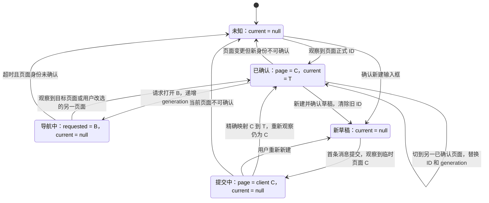
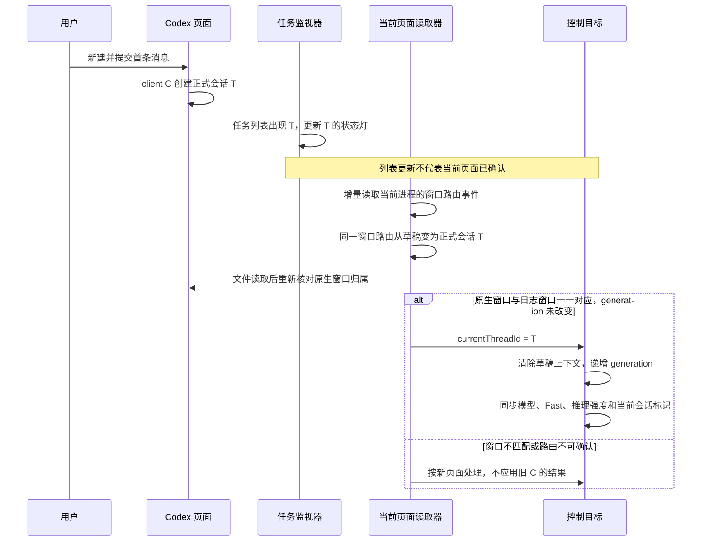

# Windows 当前会话定位

更新：2026-10-05。适配核对版本为 Codex `26.930.3930.0`。当前实现优先采用明确归属到窗口的桌面路由日志；原生页面观察作为后备，不把订阅列表当作选中状态。源码中的 DOM 属性存在，并不代表 Windows 无障碍接口能读取它们。

## 保存 ID，观察切换

点击 Micro 的 Agent／会话键时，键位已经带有会话 ID。[MainWindow.Software.cs](../../src/CodexMicro.Windows/MainWindow.Software.cs) 将它保存为导航目标，清空已确认的当前 ID；观察到页面后再接入当前 ID，统一用于模型、Fast、推理强度与当前键位灯光。仅保存在本次进程内，不把上次运行的目标恢复成当前会话。

导航意图、页面身份、正式会话 ID 分开处理。打开链接只代表发起导航；导航等待期间不能把请求目标当作已经显示的页面，也不能向它发送模型、Fast 或输入操作。

## ID 的状态机

`requestedThreadId` 对应 `_softwareNavigationTarget`，是导航意图；`pageIdentity` 是选中页面的正式 ID 或 `client-new-thread:<UUID>`；`currentThreadId` 是已经确认属于该页面的正式 ID。任务列表中每条任务的 ID 只用于各自状态灯，不能给 `currentThreadId` 赋值。

新建请求发出时立即清除旧 ID；图中的 Draft 表示新页面已经确认，之前仍属导航中。如果首条消息提交很快，可以从导航中直接进入已确认正式会话，不要求轮询必须捕捉到每个中间状态。隐藏侧栏但页面标识不变属于观察连续性，不是新建事件。无法确认的新页面不能继承旧 ID。

晚到的创建结果只能补全 `C → T` 映射，不能直接选中 T。晚到的设置结果也不能把当前目标切回旧会话。A → B → A 每次被观察到的身份变化都推进 generation，旧动作即使 ID 又相同也不能复用。

[CodexSelectedThreadReader](../../src/CodexMicro.Windows/Services/CodexSelectedThreadReader.cs) 同时返回可恢复的会话 ID 与页面标识：

- 优先增量读取 [CodexDesktopRouteReader](../../src/CodexMicro.Windows/Services/CodexDesktopRouteReader.cs) 中当前 Electron 主进程的 `browser sidebar owner sync` 事件，按 `windowId` 保存带时间戳的 `ownerRoutePath`。只有日志中唯一窗口、该进程唯一符合条件的原生窗口、当前选择窗口三者一致时才能采用。计数包含最小化窗口；多个窗口不按最新日志或前台时间猜对应关系。文件读取后重新核对窗口，旧轮转文件也不能覆盖较新路由。
- 首页、临时会话和设置页的路由同样覆盖旧聊天路由，得到空正式 ID；`/local/<UUID>` 才接入正式 ID。远程 `hostId` 不授权本地 IPC。每次动作前的选择校验都读取新增日志，不沿用一秒前的路由缓存。
- 窗口路由不可用时采用真正的实时 Document 路由。`index.html`、`detached-window.html` 和 `initialRoute` 不作为当前页面身份。
- 路由仍为临时 ID 或未暴露实时路由时，优先定位唯一可见的 `ProseMirror` 输入框，沿最多 16 层祖先确认 `data-codex-composer-root`，限定 `data-composer-placement=thread`；只检查这个根节点的至多 16 个直接子节点，读取 portal 上的 `data-above-composer-conversation-id`。该版本源码将正式 `conversationId` 写入此属性，提交后会更新，不依赖侧栏或聊天标题。只有正式 ID 同时存在于本地最近任务列表时才授权本地 IPC，避免误操作远程主机；列表只是验证来源，不能用最新任务替代属性里的 ID。
- 输入框 portal 已确认但 ID 缺失时清除旧目标；多个可见输入框也不能任取其一。若原生接口未暴露该节点，则继续采用下述侧栏身份来源。该通道复用只读 MSAA 访问，读取前后检查采样点仍属于目标窗口，不改变焦点或输入内容。
- 没有实时路由时，在标题栏工具栏内读取可见标题文本，沿 RawView 祖先定位标题容器。该组件既可能是按钮，也可能是普通文本容器；不能要求它一定是按钮或出现在 ControlView 中。
- 页面标识包含窗口、标题栏／标题容器的运行时标识及标题。它用于发现页面变化，不作为永久会话 ID。
- 没有实时路由时，从当前侧栏行的 `data-app-action-sidebar-thread-id` 读取 `local:<UUID>` 或 `local:client-new-thread:<UUID>`，同时要求 `aria-current=page`、`active=true`、`kind=local`、`host-id=local`。该字段是前端行键；新会话创建完成后仍可能保留临时 ID，不能把其中 UUID 直接当作正式 threadId。
- 对仍需侧栏定位的场景，日志还提供同一条记录中的 `conversationId=client-new-thread:…` 与 `ownerRoutePath=/local/<正式 UUID>` 映射。映射矛盾时拒绝解析，映射缺失时保持未确认；文件读取之后重新观察页面，才返回正式 ID。该后备路径不把别的窗口最近出现的会话当作当前页。
- 侧栏行先由 UIA 定位，再以该行中心点调用只读 MSAA 接口，沿最多 12 层祖先读取 `ISimpleDOMNode` 的 HTML 属性，每层最多 64 个属性。读取前后检查该点仍属于目标窗口；不移动指针、不点击。Chromium 的原生 UIA provider 不提供 LegacyIAccessible pattern，因此不依赖该 pattern。HTML 属性首次启用后可能在下一次轮询才可用。实现依据：[Chromium 的 HTML 属性与 QueryService](https://chromium.googlesource.com/chromium/src/+/refs/heads/main/ui/accessibility/platform/browser_accessibility_com_win.cc)。
- 标题只用于检查标题栏与已取得 ID 的侧栏行是否一致。名称索引和实时列表均可能滞后，因此保留同一 ID 在两者中的名称，不让旧列表覆盖刚生成的名称。名称缺失、重名或暂时唯一都不能授权向另一个会话写入。
- 已观察到侧栏行但其 ID 不可读、来自远程主机或与标题栏冲突时，显式禁止沿用旧 ID。仅侧栏消失且页面标识不变时，保留本次进程已经确认的目标。

标题栏扫描限定在工具栏内，不扫描聊天消息来拼身份。UIA 读取在后台任务执行；索引使用异步文件读取，并在观察页面前完成，避免异步读文件期间切换会话后仍返回旧标题对应的 ID。原有单文件元数据检查保留在后台任务内，不在 WPF Dispatcher 上执行。

实时列表沿用监视器的两秒刷新与已有请求，不为选择轮询另起 App Server。列表名称变化后立即重新核对当前页面；即使未读或任务状态读取失败，已成功读取的会话元数据仍能供一致性检查使用。读取失败则移除实时补充数据。新会话不需要等名称进入索引；临时 ID 必须经过精确映射，不能剥掉前缀后作为正式会话目标。

窗口路由不再等待 UIA 先提供临时 ID：每次选择刷新都增量读取日志。读取当前进程最近两个 UTC 日期目录，每目录最多八个主线程日志，首次每文件最多尾部 4 MiB，之后按字节位置增量异步读取，未写完的末行留待下次。目录枚举和文件长度元数据是同步 API，限定在该后台任务内；不在 WPF Dispatcher 上执行。没有新增 IPC 请求或应用操作。选择结果改变时记录来源与 threadId；复用既有同步诊断写入器，仅在后台写一行，不写聊天内容或标题。

## 状态更新

| 事件 | 处理 |
| --- | --- |
| 点击另一个 Agent | 保存请求目标、清除当前 ID 和旧草稿／旋钮预览、推进目标版本并发起导航确认 |
| 仅隐藏侧栏，页面仍相同 | 保留已保存的 ID；模型、Fast 和灯光继续共用该目标 |
| 在 Codex 中切到能读取正式 ID 的聊天，包括同名聊天 | 更新 ID 和页面标识，旧目标的排队操作失效 |
| 当前侧栏行没有可确认的正式 ID，或来源矛盾 | 清除旧目标，不能因标题或页面标识相同继续修改上一条会话 |
| 新聊天／设置页／窗口无法读取 | 清除会话目标；草稿必须经过独立输入框确认 |
| 首条消息发出，正式路由已产生 | 通过同一窗口的路由事件接入正式 ID，清除草稿上下文；不要求侧栏展开或 DOM 属性可读 |
| 新聊天导航尚未观察到草稿，就已显示正式会话 | 忽略仍属于原页面的结果；确认不同页面的正式 ID 后结束导航等待，不要求先看到空白草稿 |
| 导航尚未完成 | 忽略仍属于原页面的观察；如果已经出现不同的新页面，按新观察更新或清除目标 |
| 导航超时 | 采用最后观察到的 ID；无可确认 ID 则清除，不按等待时长假定导航成功 |

模型按钮、Fast 派发前校验、旋钮调整及周期刷新均经过同一个选择刷新入口。后台轮询不堆积；动作校验等待正在进行的读取完成。读取过程中如果用户重新选择 Agent，旧结果不能覆盖新目标。

排队动作捕获目标 ID 和版本，派发前重新核对。目标或页面变化后，旧动作不转发到新会话。IPC 已经发出的操作仍属于原 ID；不因晚到结果切回旧目标，也不在结果未知时自动重发。原生输入另外检查导航状态，避免将消息发送到仍停留的旧页面。

淡绿光仍遵循原有空闲当前会话规则；正在运行、等待输入等状态继续使用相应状态色。本轮没有重新设计灯光样式。

## 验证与边界

一次经用户明确授权的只读检查确认：当前 Codex 窗口可以读取标题与输入框，但不提供实时 Document 路由、选中侧栏行和可用的输入框 DOM 属性。这解释了先前方案为什么在状态灯已更新后仍没有控制目标。未操作模型、Fast 或发送按钮；本机检查输出和原始日志不进入公开仓。

运行现有会话解析、控制派发、目标变化、WPF 展示与灯光回归测试，以及桌面应用／插件编译；未新增或改写测试。现有测试没有覆盖新增的输入框／侧栏跨进程 HTML 属性读取和日志映射通道，编译通过不代表这些通道已在运行中的 Codex 完成验收。控制请求日志记录实际 threadId，便于核对写入对象。

仍需留意：窗口重建、多个窗口、日志延迟与格式变化。窗口路由和原生读取均不可用时停止建立新的 IPC 目标；后备路径仅能在同一页面标识下保留已确认 ID。若 Codex 在两次读取间完成往返，轮询无法证明中间没有切换，不能宣称与导航原子同步。没有明确页面证据时，不用后台订阅、最近活跃时间或标题匹配猜测新目标。

日志字段来自上述 Codex 版本的源码及既有日志，不是公开 API。日志关闭、格式变化、记录超出读取窗口或被清理时，窗口路由不能确认；不会恢复标题推断。未来若有直接暴露原生窗口与实时 `threadId` 的可靠接口，应替换这段日志读取。
