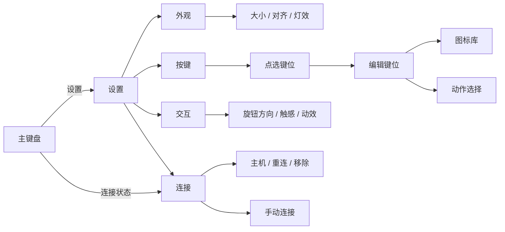

# Codex Micro：设置交互

> 2026-10-04 · 用户更新的平台方向。Windows 1.0.0 源码已同步；键帽动作、测试资料与相关设置控件更新以当前远端实现为准。

## Mac preview.11 实现

2026-10-05 根据用户“继续复刻 Windows 版本，包括设置页面”的要求，按仓库当前 `MicroSettingsWindow.xaml` 与 `KeycapEditorWindow.xaml` 落地设置。Cmd+, / 菜单栏打开单列设置层，点击 160×166 键盘预览或主键盘命令键右键进入该键编辑；保存提交本机覆盖，取消 / Esc 丢弃草稿。白旋钮右键定位到交互设置，额度旋钮定位到快捷模型；旧控制清单删除。审批浮层复用统一样式，保留请求详情。关闭设置恢复键盘位置与当前缩放。

图标使用 28 设计点框、24 设计点可见轮廓，取消小窗口 24 屏幕点下限。MIND± 使用 Windows 当前的彩色加减滑轨和悬停动效。设置层固定字号，不随键盘缩放。当前选项、保存范围与未接入能力见 [Mac README](../../apps/macos/README.md)。下面的待定合同是此次实现之前的方向记录。

preview.11 按用户防呆要求对齐当前 Windows 键帽选择规则：选择不同键帽时同时选择其默认动作；选好后仍可自定义动作。打开编辑器、点击同一键帽及刷新目录保留原自定义绑定，取消不改动已保存值。空白键清空动作。Mac 允许保存尚未接入的默认动作以保留配置含义，但主键盘保持禁用并显示实际动作名称；Windows 当前编辑器会拒绝保存未支持动作。隔离界面已逐一验证 34 个可见键帽，详见 [本轮对照](macos-windows-parity-2026-10-05.zh-CN.md)。

## Mac 操作映射（preview.14）

2026-10-05 补齐 Mac 原生输入路径。触控板在系统“辅助点按”设置为双指点按时，双指点按等同鼠标右键；Control＋单击也进入同一辅助操作。Micro 不修改系统偏好。双指横向或纵向滑动对应滚动，鼠标指针需位于对应旋钮上。

| 控件 / 模式 | 单击 / 短按 | 右键 / 双指辅助点按 | 拖动、滚轮 / 双指滑动 |
| --- | --- | --- | --- |
| 命令键 | 执行当前保存的动作 | 打开菜单，再选编辑键位 | 无旋钮动作 |
| 任务键 | 默认激活；关闭单击激活后先选择、双击激活 | 打开菜单，标记该精确会话未读 | 无旋钮动作 |
| 白旋钮：推理强度 | 切换快捷模型 A/B | 交互设置 | 改变当前模型支持的强度档位 |
| 白旋钮：输入区选择 | 激活当前选中的输入区控件 | 交互设置 | 上一个 / 下一个输入区控件 |
| 白旋钮：会话滚动 | 滚到会话底部 | 交互设置 | 向上 / 向下滚动会话 |
| 白旋钮：自定义 | 执行 Codex 配置的 click 动作 | 交互设置 | 执行已支持的 left / right 动作 |
| 额度旋钮 | 切换快捷模型 A/B | 当前对话 / 模型设置 | 改变推理强度 |
| 摇杆四周方向键 | 执行该方向绑定 | 无动作 | 中心按住拖动；换方向或回中再拨可继续操作 |
| 机身空白处 | 无动作 | 就地打开窗口菜单 | 按住拖动移动窗口 |

长按阈值为 0.65 秒：白旋钮进入交互设置，额度旋钮打开 `codex://settings/codex-micro` 并核对页面，机身空白处打开窗口菜单。右键、Control＋单击、长按和滚动均不会附带执行短按；拖动超过阈值后释放也不会切 A/B。白旋钮的自定义 longPress 保留为本机设置入口。

方向对齐 Windows：拖向右或向上计为顺时针，默认降低推理强度；反向提高，启用“反转方向”后交换，自定义方向也遵循此设置。导航模式默认顺时针对应下一个 / 向下。拖动先跨越 6 个设计点后锁定主轴，每 12 点一档。Mac 原生滚动按二维位移锁定主轴，精细位移每 12 点一档，普通滚轮每行一档；小数增量累计，松手后的惯性不继续切档。自然滚动方向沿用系统设置。

AppKit 本窗口的滚动事件先按 UIKit 实际命中区域定位两个旋钮；已处理事件不再交给 UIKit，设置页和其他区域仍使用原滚动路径。连续输入使用同一原生目标排队，已确认的 client 会话路由可导航；无明确路由的输入框仍限于设置动作。切换会话或目标失效时停止剩余操作。不可用输入使用现有控制错误灯反馈。

实现：`DialInput.swift`、`DialMapping.swift`、`MicroView.swift`、`MicroModel.swift`、`Bridge.swift`。本次完成 Catalyst 编译及 124 项现有映射、面板、原生回放与页面测试；没有新增测试代码或操作真实 UI。原生事件到实体鼠标 / 触控板的端到端结果尚待现场验证，现有回放不覆盖新增手势识别器。

preview.15 增加的命令键：TERM 切换当前 Codex 窗口内的终端面板；MAGIC 在精确会话上切换置顶；DWN 调用原生 Markdown 复制；DEL 调用原生归档并保留 Codex 的确认。更换这些键帽同样默认改为对应功能；双指辅助点按仍用于编辑键位，不执行这些动作。

preview.16 的 NAV 在当前 Codex 会话内新增浏览器页；TIME 打开已安排任务管理页。NAV 不向外部浏览器打开网址，TIME 不创建任务。两项分别回读新面板身份和任务管理路由。

preview.17 的 BUG 打开反馈表单，PARTY 从当前父对话新建侧边聊天，UPL 打开文件选择器等待用户选择；三者都不会自动发消息。UPL 不把打开窗口当成附件已添加。它们沿用相同的单击执行、辅助点按编辑映射。

preview.18 的 BRANCH、PR、BRCH 分别打开原生分支、普通 PR、草稿 PR 表单。按键不填写或提交表单；普通 / 草稿 PR 的默认选项分别回读。更换键帽同样采用对应命令，辅助点按仍用于编辑。

preview.19–20 的 PLAY 和 GIT 沿用单击执行、辅助点按编辑。PLAY 运行配置中的首个适用环境动作；GIT 打开原生提交／推送或前置分支表单，后续确认由表单处理。更换键帽即默认切换对应功能。

preview.21 的 MRG 打开原生合并确认，PAINT 打开专用照片选择器。二者仍是单击执行、辅助点按编辑；更换键帽默认切到对应功能。PAINT 没有照片菜单项且未配置专用快捷键时保持不可用结果，不借用普通文件入口。

preview.22 的 YOLO / YEET 单击在当前光标或选区写入 `:yolo:` / `:yeet:`；不会发送或改变权限。辅助点按仍进入键位编辑。图标库包含全部 40 个目录键帽，五个空白键换绑后均为零动作；再次选中同一键帽继续保留显式自定义动作。

preview.23 在设置的任务来源中增加“自定义映射”：14 个槽位按账号和本机存储分别保存，可使用最近任务填充、按完整 UUID 选任务或清空。主键盘前 6 个槽位和监控页 14 个槽位保持对应，缺失任务不让其他任务顶替。任务键单击／双击仍遵循原设置，辅助点按仍是标记未读；映射在设置页修改，保存不执行任务。

## 当前方向

设置改为**叠层，点哪设置哪**，从具体控件进入该控件的设置。Mac 跟随这套对象定位方式，不再实施此前的分类栏、宽设置窗口与常驻预览方案。

当前远端已包含键帽动作与设置控件更新，但尚未给出叠层的进入/退出、正常按键操作与设置点击如何区分、层间返回、草稿提交和取消合同。Mac 不自行设计另一套触发方式，也不把点击任务键直接改为编辑设置。

图标与动作分字段保存；更换键帽默认同步动作，之后可显式覆盖。编辑不触发实际动作，准确目标与结果反馈仍是需要保留的约束。Mac 的菜单栏显示/隐藏、置顶、窗口尺寸属于平台窗口管理。

新对话下的一系列问题据用户反馈已在 Windows 修复。远端 1.0.0 已同步，后续按当前源码重新核对草稿行为，不再按旧缺陷推导。测试已提供新的分层资料；Mac 当前边界见 [验证边界](verification-boundaries.zh-CN.md)。

## Mac 功能预览的临时入口（已由 preview.9 替换）

`preview.5` 为已有对话接入旋钮后，沿用原有控制清单承接必要的模式、方向与 A/B 值。额度钮短按恢复 Windows 的 A/B 动作，原清单改由该控件右键或长按打开；白旋钮同样可就地选择推理模式或跟随 Codex。偏好仅写入 Mac 本地存储，设置点击不触发对话写操作。这不是新版叠层设置的入口、层间返回或保存合同；叠层合同明确后替换呈现层，复用独立功能逻辑。

## 历史资料

下面保留先前提案与旧 Windows 样式记录，供查阅尺寸、材质和资源出处；其中的设置导航已被叠层方向替代。

2026-10-03 提案及旧 Windows 设置样式记录（非当前实施方案）

> 2026-10-03 · macOS 交互设计提案，尚未实现。Windows 设置样式的后续实现见末节。
> 当前目标为 macOS 桌面版；Windows 作为视觉与键位基准。先前 UIKit 方案仅为历史原型，旧 Avalonia Foundation Preview 已废弃，见[平台方向](platform-direction.zh-CN.md)。

2026-10-04 Windows 新增 Sketch 动作与“拆分语音键”开关；当前键帽与动作分别保存。入口、保存规则和全部可更换键帽的支持范围见[可更换按键与 Sketch](keycap-actions.zh-CN.md)。下列 macOS 提案中的早期行为观察不作为当前 Windows 支持清单。

## 当前依据

- Windows 默认窗口 442.5×457.5，最小 354×366，相对于 590×610 设计画布分别为 75% 和 60%。这些是窗口定义，不能当成现有设置页提供了完整缩放选项。
- 早期 Windows 设置曾混合布局、旋钮、语音、快捷模型、Harness 和连接。当前软件产品已收敛为 Codex 控制；键位编辑将本地图标偏好与动作分开，换图标不会重新选择动作。保存仍分两步执行，失败可能造成部分提交。详见 [2026-10-04 基线审查](windows-baseline-macos-review.zh-CN.md)。
- macOS 已有本地适配与界面草稿，尚无可运行客户端；既有 iOS 工程不能作为 macOS 实现进度。本文中的 macOS 设置仍是提案。
- 原型整机缩放也会缩小图标、数字和分页控件，需要分别约束可读性与命中区域。

## 设置层级

保留 Windows 的外壳、4×4 键位、双页与材质。设置采用 macOS 桌面宽窗口，左侧分类、中央设置、右侧常驻键盘预览；视觉以暖白和石墨灰为主。页面只出现必要的标题、值和操作标签，不增加解释性文案区。

| 页面 | 内容 | 交互 |
| --- | --- | --- |
| 外观 | 尺寸、居中 / 靠下、灯光强度 | 预览随调整更新；本地自动保存；单项恢复默认 |
| 按键 | 可点击的设备布局、当前键位绑定 | 点选键位进入编辑；主键盘长按菜单也可进入 |
| 交互 | 旋钮方向、触感、跟随系统的减少动态效果 | 本地即时生效；功能不存在时不展示空开关 |
| 连接 | 当前主机、状态、重连、移除、待确认操作 | 常用项置前；地址、令牌、指纹放入手动连接子页 |

分类切换保持窗口与预览位置稳定，图标库和动作选择在编辑区内切换。支持鼠标、键盘焦点、回车确认与 Esc 取消，不沿用手机导航栈和多层 sheet。

## 键位编辑

编辑页顶部保留键帽预览，下面只放“图标”和“动作”两行，导航栏为“取消 / 完成”。选择器返回编辑页，最后一次性提交该键位。

1. 进入编辑页时复制当前 `iconID + actionBinding` 为草稿。
2. 换图标只改变 `iconID`；换动作只改变 `actionBinding`，相互独立。
3. 旧配置若使用“图标默认动作”，首次进入编辑时先解析并保留当前实际动作，防止换图标改变行为。
4. “恢复该键默认”是单独操作，重置图标和动作；不改变其他键位。
5. 预览及图标选择不执行绑定动作。“完成”提交草稿，“取消”或 Esc 关闭丢弃草稿。
6. 外观成功保存与 Host 动作绑定成功分开记录；需要 Host 接受的绑定在回执前显示处理中，失败保留草稿。

图标库覆盖 Windows 现有目录，保留稳定 ID。按常用、开发、文件、工具、品牌、自定义分组，提供搜索与最近使用；列数按桌面编辑区宽度调整。重复别名可以合并展示，但读取旧绑定时仍兼容原 ID。图案不是能力声明，动作选择只提供当前适配器支持的操作。

## 大小规则

下表是桌面设计候选范围，仍需后续 macOS 实机评估。

| 平台 | 默认值 | 候选范围 | 上下限约束 |
| --- | --- | --- | --- |
| macOS | 75% | 60%–125% | 以显示器可用工作区限制上限；保持宽高比例 |
| Windows（后续） | 保留现有 75% | 60%–125% | 以工作区限制上限；保持宽高比例 |

**百分比基准要明确。** 100% 对应 590×610 的设计画布；macOS 按逻辑点计算，Windows 按 DIP 计算。设置显示百分比与对应宽高，不将屏幕物理像素作为缩放基准。

尺寸页提供滑块、当前百分比、对应宽高和“恢复默认”。滑动实时预览，按 5% 吸附，松手保存。工作区产生的非整刻度边界仍可选；范围中不出现用户实际无法达到的值。

尺寸约束分三层：

- **设备外观**：外壳、键帽位置按比例变化，4×4 结构不重排。
- **内容可读性**：图标以独立尺寸下限绘制，原型候选 18 pt；额度数字设置独立下限，必要时简化次要显示。设置页文本跟随系统字体，不随设备缩放。
- **命中区域**：鼠标命中区域与图标分开约束，不互相覆盖；分页与旋钮支持键盘操作和清楚的焦点反馈。具体下限留待 macOS 实机评估。

保存用户偏好，实际显示尺寸按当前显示器工作区约束。切换显示器或窗口空间变化时不覆盖用户偏好；空间恢复后按原偏好显示。

尺寸预览为只读视图，不接动作回调；滑块拖动不能触发键帽操作，也不应让承载滑块的面板跟着缩放。

## macOS 落地边界

- macOS 客户端尚未实现，技术栈待定；不复用已废弃的 AgentController Avalonia 壳。
- 按桌面分类与常驻预览建立设置窗口；连接页以实际桌面适配能力为准，不直接套用 iOS 的远程 Host 表单。
- 新增本地外观偏好与尺寸计算策略；把视觉尺寸、图标尺寸和命中区域从整机 transform 中分离。
- 键位编辑使用独立草稿，图标选择器采用桌面网格；主键盘保持既有布局比例。
- 编辑器确认前不更新活动绑定；Host 尚未支持的映射只作为本地草稿，不能显示为已生效。
- 默认保留 Windows 视觉与现有操作含义；先落设置导航和尺寸规则，再接键位编辑及完整图标库。

2026-10-03 的平台梳理仅纠正平台方向与设计提案，尚未实现 macOS 客户端，未修改 Windows 设置、键位绑定或缩放范围，未运行 UI 测试。

## Windows 设置样式（2026-10-04）

Windows 设置采用极简原生方向：冷白底、石墨文字、鼠尾草绿交互状态；布局、交互、快捷模型和连接沿单列排列，以间距和细分隔线组织内容。

- 键盘实时预览缩至 160×166 DIP，与尺寸滑块并排，保留现有键位编辑入口。键位轮廓常显，鼠标悬停和键盘焦点分别增强轮廓。
- 移除设置分组的大圆角卡片、标题徽标及隐藏的解释性文本；普通设置行采用最小高度，标签允许换行。
- 下拉选择、开关、按钮与滑块统一控件高度、焦点反馈和配色；弹出列表不使用动画。高对比度模式改用 Windows 系统颜色。
- 设置控件关联本地化的无障碍名称；连接状态同时显示文字，保存失败保留错误提示。设置文案继续使用 Micro 自身的本地化入口。
- 样式集中在 [MicroSettingsResources.xaml](../../src/CodexMicro.Windows/MicroSettingsResources.xaml)，仅供 [设置窗口](../../src/CodexMicro.Windows/MicroSettingsWindow.xaml) 使用，不改变主键盘材质。

本节仅记录 Windows 设置呈现；现有设置保存机制、键位绑定、尺寸范围和 macOS 实现状态保持原样。

## Windows 思考强度上限提示（2026-10-04）

模型旋钮在当前模型的最高思考档位将强度环显示为珊瑚红（`#FF9E8B`），降低档位后恢复原有配色。最高档取当前模型目录的最后一个受支持档位，因此最高为 `max` 的模型也能提示；目录不可用时仅将已知的全局最高档 `ultra` 标红。保留原有环形刻度、模型名称与无障碍档位名称，额度显示继续使用原有阈值。

模型目录在现有额度刷新周期内通过后台任务读取本地缓存，避免在 UI 线程增加同步文件读取。调整强度时继续使用操作流程取得的模型目录。

## Windows 悬停提示（2026-10-04）

主键盘提示采用冰白水晶面板：外框使用不透明的浅灰绿（`#F3F7F5`），保留窄切面、顶部高光与淡化的底部折射亮边，单层柔影表达悬浮高度。文字区使用近白底色（`#FCFDFC`），避免背后文字干扰阅读。外缘圆角 12 DIP、内表面圆角 8 DIP，标题、正文与额度数字分别使用 14、12、26 DIP 字号；含阴影留白的提示最大宽度 380 DIP。

额度窗口以名称、大百分比和细进度条显示；重置条目与到期时间分列对齐，更新时间和操作标签通过细线分区。长内容换行，保留刷新失败状态和下一轮模型切换含义。文本及日期格式通过 Micro 本地化入口解析，无障碍提示保留完整信息。

展开总时长 180 ms：外壳从 97% 宽、84% 高展开并上移 6 DIP，文字延迟 30 ms 后淡入，保持原字号，不随外壳缩放。只改变渲染变换与透明度，不逐帧重新布局；关闭时清理动画，额度更新复用已打开的提示，不重播入场。关闭系统客户区动画、关闭工具提示动画或启用高对比度时立即显示；高对比度模式使用系统颜色并去除光学装饰。

提示组件样式位于 [MicroToolTipResources.xaml](../../src/CodexMicro.Windows/Controls/MicroToolTipResources.xaml)，由主键盘资源字典加载；额度内容位于 [MainWindow.QuotaHelp.cs](../../src/CodexMicro.Windows/MainWindow.QuotaHelp.cs)，动画位于 [MicroToolTipMotion.cs](../../src/CodexMicro.Windows/Controls/MicroToolTipMotion.cs)。代码创建的提示显式引用共享样式，并替换系统默认弹出动画，避免两套动画叠加。

设计参考 Windows 的[临时浮层材质](https://learn.microsoft.com/en-us/windows/apps/design/style/acrylic)与[动效原则](https://learn.microsoft.com/en-us/windows/apps/design/signature-experiences/motion)。当前实现是 WPF 矢量水晶材质，不采集桌面背景或引入额外图形依赖。

## Windows 右键菜单（2026-10-04）

面板与旋钮右键菜单共用 [MicroMenuResources.xaml](../../src/CodexMicro.Windows/Controls/MicroMenuResources.xaml)，使用 [MicroPopupPalette.xaml](../../src/CodexMicro.Windows/Controls/MicroPopupPalette.xaml) 的白至浅绿灰表面、石墨文字和鼠尾草绿高亮；悬停提示复用其中的边线和强调色，底色单独调浅。菜单外框圆角 8 DIP、选中行圆角 4 DIP，外缘收为 1 DIP 细线，配单层轻阴影，不使用提示面板较厚的切面。最小行高 32 DIP，勾选标记、文字与子菜单箭头分列对齐，分隔线使用单条细线。文字继承系统菜单字号，行高可随内容增长；键盘焦点保留清晰轮廓，高对比度使用系统颜色。

Micro 托盘及语言子菜单由 [MicroTrayMenu.cs](../../src/CodexMicro.Windows/Controls/MicroTrayMenu.cs) 读取同一配色字典绘制：保留原生 WinForms 的托盘激活、键盘导航和子菜单行为；采用 8 DIP 圆角轮廓与一像素细边，保留系统菜单阴影。勾选列透明，不再绘制默认灰色图标栏或蓝色勾选方框。字体与行内距适配 DPI，托盘和面板菜单采用系统菜单字体；高对比度回到系统渲染器与矩形轮廓。

托盘菜单通过默认布局内距和菜单项外距共同保留四周留白，避免 WinForms 重新布局覆盖内距；行内距只影响高度，文字、勾选与箭头按完整行高居中。托盘、语言子菜单与 WPF 右键菜单使用同一浅绿灰细边和折线箭头；WPF 子菜单首项对齐父项，名称与快捷键各自共享列宽。保留的 Harness 菜单也复用右键菜单样式。

键帽动作下拉框使用 [MicroComboResources.xaml](../../src/CodexMicro.Windows/Controls/MicroComboResources.xaml)，沿用菜单配色、8 DIP 外框、4 DIP 选中行和键盘焦点轮廓；弹出列表与触发控件等宽，高度上限包含边框与内距，长名称省略并通过提示保留全文。动作图标继承所在项的文字颜色，禁用项不再整体降低透明度。键帽编辑器中的 Esc 先关闭下拉列表，再关闭窗口。

Mac preview.24 的任务来源增加“固定任务”：读取本机 Codex 现代固定分组，保持分组内顺序，控制页前 6 位、监控页最多 14 位。空分组不会补最近任务；协议或身份不可用时没有可派发槽位。取消固定／重排发生在按住或悬停期间时，冻结画面保留位置，但新旧按压都重新检查当前位置与 ID。此来源不迁移旧 pins，也不更改 Codex 固定设置。

Mac preview.25 的“优先级排序”先读取完整本机交互任务候选，再按待回应／审批、未读、运行中、空闲排序，同档按最近活动时间排序；不再先截断最近 14 条。灯光状态独立，例如运行中未读仍显示运行灯。悬停期间固定所见任务身份，离开悬停才移动槽位；不完整目录没有可执行的优先级槽位。

Mac preview.27 的“自定义”任务槽位支持命令菜单：14 位中可混用固定精确会话、最近第 1–6 个会话以及当前支持的操作。最近命令在空闲时跟随列表，悬停和按住时固定所见 ID；不存在的第 N 项不可用。命令与固定 ID 互斥，换绑或清空立即退役旧按压，同一会话重新分配会移出该范围的旧槽位。双击模式下，第一次点击只选择关联会话；没有关联会话的纯命令不会在第一次选择时执行。编辑仍在设置页，不增加主面板说明元素。

Mac preview.28 的“固定任务”同时包含本机现代固定项目成员：项目保留侧栏手动混排位置，单独固定会话保持服务端相对顺序；切到最近活动排序后重新排序。项目内部使用明确手动列表、同范围上次确认顺序或最近活动次序，排除已单独固定的会话，然后取前 14 项。只固定项目也可显示成员；不完整项目目录或成员身份冲突使整个来源不可用。项目重排、移除或读取期间改配置会退役旧操作，不修改 Codex 项目、pins 或成员关系。

Mac preview.29 的客户端路由可使用原生 Fast／Plan／MIND 和模型设置，继续显示“当前输入框”，不把 clientThreadId 显示或复制为正式会话 ID。同一输入框切换客户端后旧操作失效；客户端身份本身不能证明未提交，因此不由它启用发送、Stop、审批或 Fork。实时地址上的 hostId 参与身份判断，远程或重复范围不能恢复旧本机会话。

Mac preview.30 修正已知客户端路由被桌面总入口拒绝的问题，模型和入口使用同一身份判断。每次原生设置仍重新读取模型目录；客户端在读取期间变化、模型被移除或强度组合不支持时不输入，并发第二次写入不干扰正在执行的第一次操作。

Mac preview.31 对明确客户端路由增加只读 UUID 关联：账号、存储、精确记录和原生窗口均验证后，现有当前会话区域可显示／复制 ID，并加入显式任务选择。Fast／Plan／MIND／模型仍按输入框 token 操作；关联不授权提交、停止或审批。全局首页草稿记录不用于自动填槽。

Mac preview.32 将热键首页、热键新建页和带 projectId 的本机项目首页识别为各自的草稿入口。保持原来的 Fast／Plan／MIND／模型交互，不添加主面板文本。切项目或草稿创建出客户端路由后，已捕获的旧操作失效；空加载页不会启用草稿设置。
