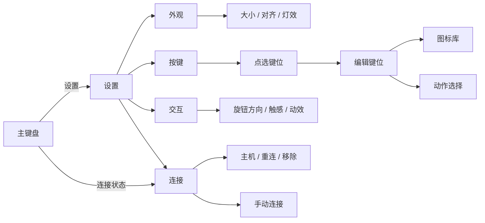

# Codex Micro：设置、键帽编辑与尺寸规则

> 2026-10-03 · macOS 交互设计提案，尚未实现。Windows 设置样式的后续实现见末节。
> 当前目标为 macOS 桌面版；Windows 作为视觉与键位基准。先前 UIKit 方案仅为历史原型，旧 Avalonia Foundation Preview 已废弃，见[平台方向](platform-direction.zh-CN.md)。

## 当前依据

- Windows 默认窗口 442.5×457.5，最小 354×366，相对于 590×610 设计画布分别为 75% 和 60%。这些是窗口定义，不能当成现有设置页提供了完整缩放选项。
- Windows 软件设置页同时容纳布局、旋钮、语音、快捷模型、Harness 和连接。键帽编辑器换图标后重新选中“键帽默认动作”，容易连带改变用户原本想保留的功能。
- macOS 目前只有设置设计稿，尚无可运行客户端；既有 iOS 工程不能作为 macOS 实现进度。
- 原型整机缩放也会缩小图标、数字和分页控件，需要分别约束可读性与命中区域。

## 设置层级

保留 Windows 的外壳、4×4 键位、双页与材质。设置采用 macOS 桌面宽窗口，左侧分类、中央设置、右侧常驻键盘预览；视觉以暖白和石墨灰为主。页面只出现必要的标题、值和操作标签，不增加解释性文案区。

| 页面 | 内容 | 交互 |
| --- | --- | --- |
| 外观 | 尺寸、居中 / 靠下、灯光强度 | 预览随调整更新；本地自动保存；单项恢复默认 |
| 按键 | 可点击的设备布局、当前键位绑定 | 点选键位进入编辑；主键盘长按菜单也可进入 |
| 交互 | 旋钮方向、触感、跟随系统的减少动态效果 | 本地即时生效；功能不存在时不展示空开关 |
| 连接 | 当前主机、状态、重连、移除、待确认操作 | 常用项置前；地址、令牌、指纹放入手动连接子页 |

分类切换保持窗口与预览位置稳定，图标库和动作选择在编辑区内切换。支持鼠标、键盘焦点、回车确认与 Esc 取消，不沿用手机导航栈和多层 sheet。

## 键位编辑

编辑页顶部保留键帽预览，下面只放“图标”和“动作”两行，导航栏为“取消 / 完成”。选择器返回编辑页，最后一次性提交该键位。

1. 进入编辑页时复制当前 `iconID + actionBinding` 为草稿。
2. 换图标只改变 `iconID`；换动作只改变 `actionBinding`，相互独立。
3. 旧配置若使用“图标默认动作”，首次进入编辑时先解析并保留当前实际动作，防止换图标改变行为。
4. “恢复该键默认”是单独操作，重置图标和动作；不改变其他键位。
5. 预览及图标选择不执行绑定动作。“完成”提交草稿，“取消”或 Esc 关闭丢弃草稿。
6. 外观成功保存与 Host 动作绑定成功分开记录；需要 Host 接受的绑定在回执前显示处理中，失败保留草稿。

图标库覆盖 Windows 现有目录，保留稳定 ID。按常用、开发、文件、工具、品牌、自定义分组，提供搜索与最近使用；列数按桌面编辑区宽度调整。重复别名可以合并展示，但读取旧绑定时仍兼容原 ID。图案不是能力声明，动作选择只提供当前适配器支持的操作。

## 大小规则

下表是桌面设计候选范围，仍需后续 macOS 实机评估。

| 平台 | 默认值 | 候选范围 | 上下限约束 |
| --- | --- | --- | --- |
| macOS | 75% | 60%–125% | 以显示器可用工作区限制上限；保持宽高比例 |
| Windows（后续） | 保留现有 75% | 60%–125% | 以工作区限制上限；保持宽高比例 |

**百分比基准要明确。** 100% 对应 590×610 的设计画布；macOS 按逻辑点计算，Windows 按 DIP 计算。设置显示百分比与对应宽高，不将屏幕物理像素作为缩放基准。

尺寸页提供滑块、当前百分比、对应宽高和“恢复默认”。滑动实时预览，按 5% 吸附，松手保存。工作区产生的非整刻度边界仍可选；范围中不出现用户实际无法达到的值。

尺寸约束分三层：

- **设备外观**：外壳、键帽位置按比例变化，4×4 结构不重排。
- **内容可读性**：图标以独立尺寸下限绘制，原型候选 18 pt；额度数字设置独立下限，必要时简化次要显示。设置页文本跟随系统字体，不随设备缩放。
- **命中区域**：鼠标命中区域与图标分开约束，不互相覆盖；分页与旋钮支持键盘操作和清楚的焦点反馈。具体下限留待 macOS 实机评估。

保存用户偏好，实际显示尺寸按当前显示器工作区约束。切换显示器或窗口空间变化时不覆盖用户偏好；空间恢复后按原偏好显示。

尺寸预览为只读视图，不接动作回调；滑块拖动不能触发键帽操作，也不应让承载滑块的面板跟着缩放。

## macOS 落地边界

- macOS 客户端尚未实现，技术栈待定；不复用已废弃的 AgentController Avalonia 壳。
- 按桌面分类与常驻预览建立设置窗口；连接页以实际桌面适配能力为准，不直接套用 iOS 的远程 Host 表单。
- 新增本地外观偏好与尺寸计算策略；把视觉尺寸、图标尺寸和命中区域从整机 transform 中分离。
- 键位编辑使用独立草稿，图标选择器采用桌面网格；主键盘保持既有布局比例。
- 编辑器确认前不更新活动绑定；Host 尚未支持的映射只作为本地草稿，不能显示为已生效。
- 默认保留 Windows 视觉与现有操作含义；先落设置导航和尺寸规则，再接键位编辑及完整图标库。

2026-10-03 的平台梳理仅纠正平台方向与设计提案，尚未实现 macOS 客户端，未修改 Windows 设置、键位绑定或缩放范围，未运行 UI 测试。

## Windows 设置样式（2026-10-04）

Windows 设置采用极简原生方向：冷白底、石墨文字、鼠尾草绿交互状态；布局、交互、快捷模型和连接沿单列排列，以间距和细分隔线组织内容。

- 键盘实时预览缩至 160×166 DIP，与尺寸滑块并排，保留现有键位编辑入口。键位轮廓常显，鼠标悬停和键盘焦点分别增强轮廓。
- 移除设置分组的大圆角卡片、标题徽标及隐藏的解释性文本；普通设置行采用最小高度，标签允许换行。
- 下拉选择、开关、按钮与滑块统一控件高度、焦点反馈和配色；弹出列表不使用动画。高对比度模式改用 Windows 系统颜色。
- 设置控件关联本地化的无障碍名称；连接状态同时显示文字，保存失败保留错误提示。设置文案继续使用 Micro 自身的本地化入口。
- 样式集中在 [MicroSettingsResources.xaml](../../src/CodexMicro.Windows/MicroSettingsResources.xaml)，仅供 [设置窗口](../../src/CodexMicro.Windows/MicroSettingsWindow.xaml) 使用，不改变主键盘材质。

本节仅记录 Windows 设置呈现；现有设置保存机制、键位绑定、尺寸范围和 macOS 实现状态保持原样。

## Windows 悬停提示（2026-10-04）

主键盘提示采用冰白水晶面板：复用键帽侧面的材质笔刷，外缘保留窄切面、顶部高光与底部折射亮边，单层柔影表达悬浮高度。文字区使用不透明的白至浅绿灰内表面，避免背后文字干扰阅读。外缘圆角 12 DIP、内表面圆角 8 DIP，标题、正文与额度数字分别使用 14、12、26 DIP 字号；含阴影留白的提示最大宽度 380 DIP。

额度窗口以名称、大百分比和细进度条显示；重置条目与到期时间分列对齐，更新时间和操作标签通过细线分区。长内容换行，保留刷新失败状态和下一轮模型切换含义。文本及日期格式通过 Micro 本地化入口解析，无障碍提示保留完整信息。

展开总时长 180 ms：外壳从 97% 宽、84% 高展开并上移 6 DIP，文字延迟 30 ms 后淡入，保持原字号，不随外壳缩放。只改变渲染变换与透明度，不逐帧重新布局；关闭时清理动画，额度更新复用已打开的提示，不重播入场。关闭系统客户区动画、关闭工具提示动画或启用高对比度时立即显示；高对比度模式使用系统颜色并去除光学装饰。

提示组件样式位于 [MicroToolTipResources.xaml](../../src/CodexMicro.Windows/Controls/MicroToolTipResources.xaml)，由主键盘资源字典加载；额度内容位于 [MainWindow.QuotaHelp.cs](../../src/CodexMicro.Windows/MainWindow.QuotaHelp.cs)，动画位于 [MicroToolTipMotion.cs](../../src/CodexMicro.Windows/Controls/MicroToolTipMotion.cs)。代码创建的提示显式引用共享样式，并替换系统默认弹出动画，避免两套动画叠加。

设计参考 Windows 的[临时浮层材质](https://learn.microsoft.com/en-us/windows/apps/design/style/acrylic)与[动效原则](https://learn.microsoft.com/en-us/windows/apps/design/signature-experiences/motion)。当前实现是 WPF 矢量水晶材质，不采集桌面背景或引入额外图形依赖。
